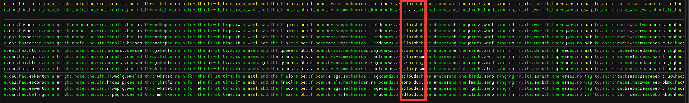
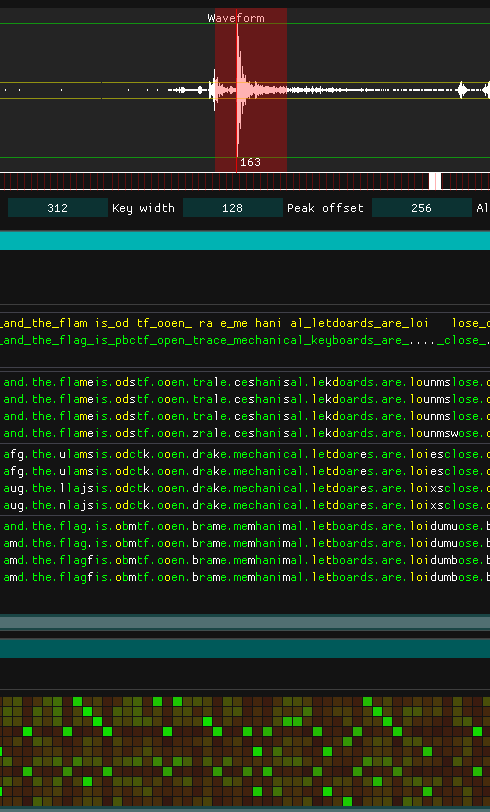
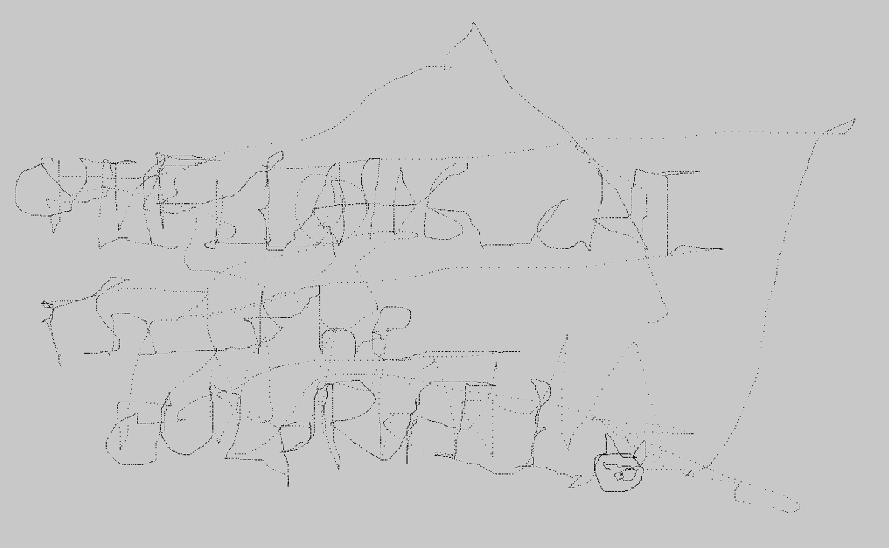
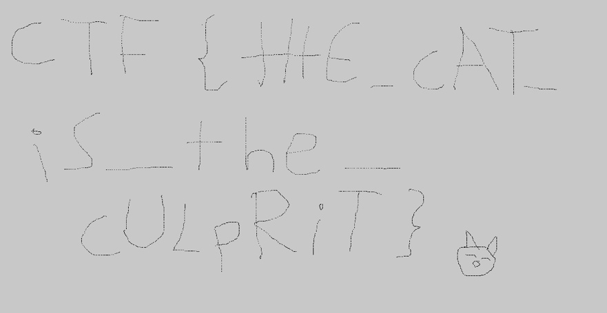

# 1 GO!! Chase the free wave!
0.2倍速慢放，每段音频时间已经是正常语速时间，但是还是不知所云，于是尝试倒放。  
0.2倍速+倒放 如果你对无线电或者ATC感兴趣，就可以轻松听出flag了  
如果不知道这段音频和flag有什么关系可以[参考wiki](https://zh.wikipedia.org/wiki/%E5%8C%97%E7%BA%A6%E9%9F%B3%E6%A0%87%E5%AD%97%E6%AF%8D)  

# 2 Mechanical Keyboard

一种思路是给所有敲键音编码，然后当作一个盲表atbash码解，分离编码后丢quip求解  

我的解法：  
使用现成的[key-tap-CTF框架kbd-audio](https://github.com/ggerganov/kbd-audio)，录入音频后需要手动补几个分割，他有几个点没有识别出来。  
之后就是自动化分析，然后手动帮程序补出确定的内容  

下图是open brace，错记为trace   
  
但是最后一位难以确认，重听音频相关片段后发现这段声音是最大的，结合已知字母合理推测麦克风位于键盘的右上角，所以可能的四个未知字母大概率由  
u o i p  
 k l  
组成，结合已知flag片段语义，推测为loud，至此得到了完整的flag  

# Free USB
wireshark导出所有数据为json，其中wireshark已经为我们处理好了鼠标移动的数据，写脚本可视化一下鼠标的移动轨迹： 
```python
from PIL import Image
import numpy as np
import json

arr = [[200 for _ in range(2000)] for _ in range(2000)]
x, y = 1000, 1000
d = json.load(open('1.json', "r", encoding="utf8"))
for i in d:
    if "usbhid.data_tree" in i['_source']['layers'].keys():
        x += int(i['_source']['layers']['usbhid.data_tree']['usbhid.data.axis.x'])
        y += int(i['_source']['layers']['usbhid.data_tree']['usbhid.data.axis.y'])
        arr[int(y)][int(x)] = 0

Image.fromarray(np.asarray(arr)).show()
``` 
但是效果并不理想：

原始数据['_source']['layers']["usbhid.data"]是一个word大的数据包，其中包含四个byte大小的部分，整数以有符号的signed int8表示：  
以 **00:01:fe:00** 举例：  
  
| 数据 |  00 | 01 | fe | 00
 -- | -- | -- | -- | --
| 含义 |  鼠标没有点击事件 | x正向移动了1 | y负向移动了2 | 滚轮没有滚动   

观察所有的数据包（可以分段set()一下）发现在一堆的移动轨迹中混入了鼠标左键点击事件（01）。  
这可能代表鼠标点击时，指针所在的位置是有意义的，那么再看看所有点击时候的点是什么样的，只需要加一行代码：  

```python
from PIL import Image
import numpy as np
import json

arr = [[200 for _ in range(2000)] for _ in range(2000)]
x, y = 1000, 1000
d = json.load(open('1.json', "r", encoding="utf8"))
for i in d:
    if "usbhid.data_tree" in i['_source']['layers'].keys():
        x += int(i['_source']['layers']['usbhid.data_tree']['usbhid.data.axis.x'])
        y += int(i['_source']['layers']['usbhid.data_tree']['usbhid.data.axis.y'])
        if i['_source']['layers']["usbhid.data"].split(":")[0] == "01":
            arr[int(y)][int(x)] = 0

Image.fromarray(np.asarray(arr)).show()
```
效果非常理想：  

看到了清晰的flag